# Software Risk Manager Kubernetes Deployment

<!-- toc -->

- [Software Risk Manager Features](#software-risk-manager-features)
  * [Core Feature](#core-feature)
  * [Scan Farm Feature](#scan-farm-feature)
  * [Tool Orchestration Feature](#tool-orchestration-feature)
- [Requirements](#requirements)
  * [Kubernetes Requirements](#kubernetes-requirements)
  * [System Size](#system-size)
  * [Core Feature Requirements](#core-feature-requirements)
    + [Core Web Workload Requirements](#core-web-workload-requirements)
    + [Core Web Database Workload Requirements](#core-web-database-workload-requirements)
    + [Core Web Replica Database Workload Requirements](#core-web-replica-database-workload-requirements)
    + [Core Persistent Storage Requirements](#core-persistent-storage-requirements)
    + [Core Internet Access Requirements](#core-internet-access-requirements)
    + [Core Pod Security Admission Requirements](#core-pod-security-admission-requirements)
  * [Scan Farm Feature Requirements](#scan-farm-feature-requirements)
    + [Scan Farm Database Requirements](#scan-farm-database-requirements)
    + [Scan Farm Cache Requirements](#scan-farm-cache-requirements)
    + [Scan Farm Object Storage Requirements](#scan-farm-object-storage-requirements)
    + [Scan Farm Node Pool Requirements](#scan-farm-node-pool-requirements)
    + [Scan Farm Private Registry](#scan-farm-private-registry)
    + [Scan Farm Ingress Requirements](#scan-farm-ingress-requirements)
    + [Scan Farm Internet Access Requirements](#scan-farm-internet-access-requirements)
    + [Scan Farm Default Pod Resources](#scan-farm-default-pod-resources)
  * [Tool Orchestration Feature Requirements](#tool-orchestration-feature-requirements)
    + [Tool Service Workload Requirements](#tool-service-workload-requirements)
    + [Workflow Controller Workload Requirements](#workflow-controller-workload-requirements)
    + [On-Cluster Workflow Storage Requirements (MinIO)](#on-cluster-workflow-storage-requirements-minio)
    + [Add-in Tool Workload Requirements](#add-in-tool-workload-requirements)
    + [Tool Orchestration Persistent Storage Requirements](#tool-orchestration-persistent-storage-requirements)
    + [Tool Orchestration Add-in Resource Requirements](#tool-orchestration-add-in-resource-requirements)
    + [Tool Orchestration Pod Security Admission Requirements](#tool-orchestration-pod-security-admission-requirements)
- [External Web Database Pre-work](#external-web-database-pre-work)
- [Persistent Storage Pre-work](#persistent-storage-pre-work)
  * [Volume Configuration Pre-work](#volume-configuration-pre-work)
  * [AWS Persistent Storage Pre-work](#aws-persistent-storage-pre-work)
    + [AWS EBS Persistent Storage Pre-work](#aws-ebs-persistent-storage-pre-work)
    + [AWS EFS Persistent Storage Pre-work](#aws-efs-persistent-storage-pre-work)
- [Scan Farm Pre-work](#scan-farm-pre-work)
  * [Private Docker Registry](#private-docker-registry)
  * [AWS Scan Farm Pre-work](#aws-scan-farm-pre-work)
    + [EKS Scanner Nodes Pre-work](#eks-scanner-nodes-pre-work)
    + [RDS for PostgreSQL (Database) Pre-work](#rds-for-postgresql-database-pre-work)
    + [ElastiCache for Redis (Cache) Pre-work](#elasticache-for-redis-cache-pre-work)
    + [Simple Storage Service (Object Storage) Pre-work](#simple-storage-service-object-storage-pre-work)
  * [GCP Scan Farm Pre-work](#gcp-scan-farm-pre-work)
    + [GKE Scanner Nodes Pre-work](#gke-scanner-nodes-pre-work)
    + [Cloud SQL for PostgreSQL (Database) Pre-work](#cloud-sql-for-postgresql-database-pre-work)
    + [Memorystore for Redis (Cache) Pre-work](#memorystore-for-redis-cache-pre-work)
    + [Cloud Storage (Object Storage) Pre-work](#cloud-storage-object-storage-pre-work)
  * [Azure Scan Farm Pre-work](#azure-scan-farm-pre-work)
    + [AKS Scanner Nodes Pre-work](#aks-scanner-nodes-pre-work)
    + [Azure Database for PostgreSQL (Database) Pre-work](#azure-database-for-postgresql-database-pre-work)
    + [Azure Cache for Redis (Cache) Pre-work](#azure-cache-for-redis-cache-pre-work)
    + [Azure Cloud Storage (Object Storage) Pre-work](#azure-cloud-storage-object-storage-pre-work)
  * [On-Cluster Scan Farm Pre-work](#on-cluster-scan-farm-pre-work)
    + [Scanner Nodes Pre-work](#scanner-nodes-pre-work)
    + [Bitnami PostgreSQL Chart Pre-work](#bitnami-postgresql-chart-pre-work)
    + [Bitnami Redis Chart Pre-work](#bitnami-redis-chart-pre-work)
    + [Bitnami MinIO Chart Pre-work](#bitnami-minio-chart-pre-work)
- [Tool Orchestration Pre-work](#tool-orchestration-pre-work)
  * [Node Pool Pre-work](#node-pool-pre-work)
  * [Object Storage Pre-work](#object-storage-pre-work)
    + [AWS](#aws)
    + [AWS IRSA](#aws-irsa)
    + [GCP](#gcp)
    + [MinIO](#minio)
- [Password Pre-work](#password-pre-work)
- [Network Policies](#network-policies)
- [TLS Connections](#tls-connections)
  * [Cert-Manager](#cert-manager)
- [Licensing](#licensing)
- [Installation - Quick Start](#installation---quick-start)
  * [Core Quick Start](#core-quick-start)
  * [Tool Orchestration Quick Start](#tool-orchestration-quick-start)
  * [Fetch Initial Admin Password](#fetch-initial-admin-password)
- [Installation - Full](#installation---full)
  * [Prerequisites](#prerequisites)
    + [Windows Prerequisites](#windows-prerequisites)
    + [PowerShell Module](#powershell-module)
  * [Clone GitHub Repository](#clone-github-repository)
  * [Helm Prep Wizard](#helm-prep-wizard)
  * [Helm Prep Script](#helm-prep-script)
    + [Configuration File Protection](#configuration-file-protection)
    + [Invoking the Helm Prep Script](#invoking-the-helm-prep-script)
  * [Invoke helm/kubectl Commands](#invoke-helmkubectl-commands)
    + [Fetch Initial Admin Password](#fetch-initial-admin-password-1)
- [Deploying with GitOps (Flux)](#deploying-with-gitops-flux)
  * [One-Time Setup Steps](#one-time-setup-steps)
    + [Flux Steps:](#flux-steps)
    + [Bitnami Sealed Secrets Steps:](#bitnami-sealed-secrets-steps)
  * [Software Risk Manager Deployment](#software-risk-manager-deployment)
- [Customizing Software Risk Manager (props)](#customizing-software-risk-manager-props)
  * [Proxy Server Example](#proxy-server-example)
    + [Public Property Values](#public-property-values)
    + [Private Property Values](#private-property-values)
    + [Rerun Helm](#rerun-helm)
  * [Specify Extra SAML Configuration](#specify-extra-saml-configuration)
  * [Specify LDAP Configuration](#specify-ldap-configuration)
  * [Tool Orchestration Add-in Tool Configuration](#tool-orchestration-add-in-tool-configuration)
    + [Add-in Example 1 - Project Resource Requirement](#add-in-example-1---project-resource-requirement)
    + [Add-in Example 2 - Global Tool Resource Requirement](#add-in-example-2---global-tool-resource-requirement)
    + [Add-in Example 3 - Node Selector](#add-in-example-3---node-selector)
- [Maintenance](#maintenance)
  * [Software Risk Manager Admin Password Reset](#software-risk-manager-admin-password-reset)
- [Backup and Restore](#backup-and-restore)
  * [About Velero](#about-velero)
  * [Installing Velero](#installing-velero)
  * [Create a Backup Schedule](#create-a-backup-schedule)
    + [Schedule for On-Cluster Database](#schedule-for-on-cluster-database)
    + [Schedule for External Database](#schedule-for-external-database)
  * [Verify Backup](#verify-backup)
  * [Restoring Code Dx](#restoring-code-dx)
    + [Step 1: Restore Cluster State and Volume Data](#step-1-restore-cluster-state-and-volume-data)
    + [Step 2: Restore Software Risk Manager Database](#step-2-restore-software-risk-manager-database)
  * [Removing Backup Configuration](#removing-backup-configuration)
  * [Reset Database Replication](#reset-database-replication)
- [Upgrades](#upgrades)
  * [TLS](#tls)
  * [Adding the Scan Farm Feature](#adding-the-scan-farm-feature)
- [Code Dx Deployment Model Migration](#code-dx-deployment-model-migration)
  * [Before you Begin](#before-you-begin)
  * [Clone the srm-k8s GitHub Repository](#clone-the-srm-k8s-github-repository)
  * [Stop Code Dx Web](#stop-code-dx-web)
  * [Stop Code Dx Tool Orchestration (if installed)](#stop-code-dx-tool-orchestration-if-installed)
  * [Run the Software Risk Manager Migration Script](#run-the-software-risk-manager-migration-script)
  * [Install Software Risk Manager](#install-software-risk-manager)
  * [Stop Software Risk Manager Web](#stop-software-risk-manager-web)
  * [Stop Software Risk Manager Tool Orchestration (if installed)](#stop-software-risk-manager-tool-orchestration-if-installed)
  * [Work Directory](#work-directory)
  * [Copy Code Dx Web Files Locally](#copy-code-dx-web-files-locally)
  * [Copy Local Code Dx Web Files to Software Risk Manager](#copy-local-code-dx-web-files-to-software-risk-manager)
  * [Backup Code Dx Database](#backup-code-dx-database)
    + [Backup On-Cluster MariaDB Database](#backup-on-cluster-mariadb-database)
    + [Backup External Database](#backup-external-database)
  * [Restore Code Dx Database](#restore-code-dx-database)
    + [Restore On-Cluster MariaDB Database](#restore-on-cluster-mariadb-database)
    + [Restore External Database](#restore-external-database)
  * [Copy Code Dx MinIO Files Locally (if installed)](#copy-code-dx-minio-files-locally-if-installed)
  * [Copy Local Code Dx MinIO Files to Software Risk Manager (if installed)](#copy-local-code-dx-minio-files-to-software-risk-manager-if-installed)
  * [Copy Tool Orchestration Resources from Code Dx to Software Risk Manager (if installed)](#copy-tool-orchestration-resources-from-code-dx-to-software-risk-manager-if-installed)
  * [Start Software Risk Manager Tool Orchestration (if installed)](#start-software-risk-manager-tool-orchestration-if-installed)
  * [Start Software Risk Manager Web](#start-software-risk-manager-web)
- [Cannot Run PowerShell Core](#cannot-run-powershell-core)
- [Software Risk Manager Helm Chart](#software-risk-manager-helm-chart)
  * [Chart Dependencies](#chart-dependencies)
  * [Values](#values)
- [Uninstall](#uninstall)
- [Troubleshooting](#troubleshooting)
  * [Core Feature Troubleshooting](#core-feature-troubleshooting)
    + [Table Already Exists](#table-already-exists)
  * [Scan Farm Feature Troubleshooting](#scan-farm-feature-troubleshooting)
    + [Scan Farm Migration Job Fails](#scan-farm-migration-job-fails)
- [Appendix](#appendix)
  * [Helm Prep Wizard](#helm-prep-wizard-1)
  * [Scan Farm Wizard](#scan-farm-wizard)

<!-- tocstop -->

# Software Risk Manager Features

The footprint of your Software Risk Manager Kubernetes deployment depends on the licensed features you plan to use. Some features depend on external systems you must configure separately, while others optionally depend on external components. The following sections include feature-related deployment diagrams. Since the parts are additive, you can conflate diagrams to see the entire footprint for your selected feature set.

## Core Feature

The Software Risk Manager web application requires a MariaDB (version 10.6.x) or a MySQL (version 8.0.x) database instance. You can provide a database instance or use what's included in the Software Risk Manager Helm chart. We treat a database you provide as an external one that you are responsible for configuring according to our guidance. An external database can be a standalone instance or one managed on your behalf by a cloud provider like AWS or Azure. A Core deployment using an external database consists of one Software Risk Manager pod.

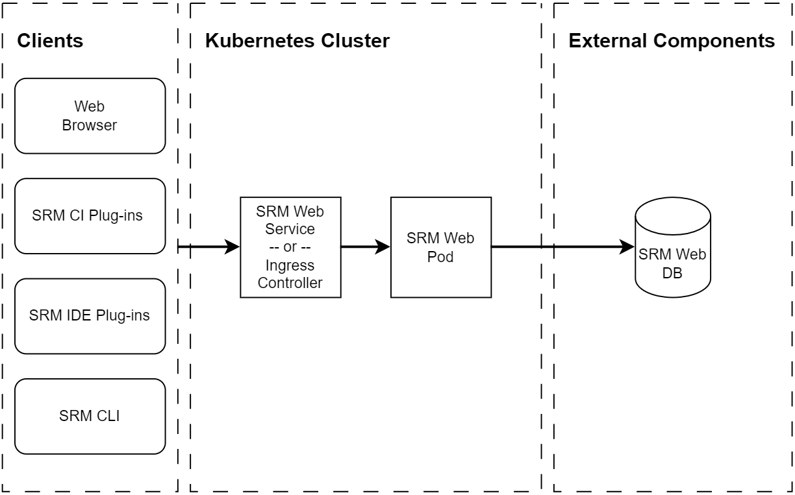

A Core deployment without an external database includes additional pods for the primary and optional secondary database instances. The MariaDB database instances store data using Kubernetes Persistent Volumes. The web application connects to the primary database instance. Data gets replicated to an optional secondary database instance that supports backups using a script that invokes mariabackup with the option to pause replica SQL threads. The Software Risk Manager Helm chart configures on-cluster database instance(s).

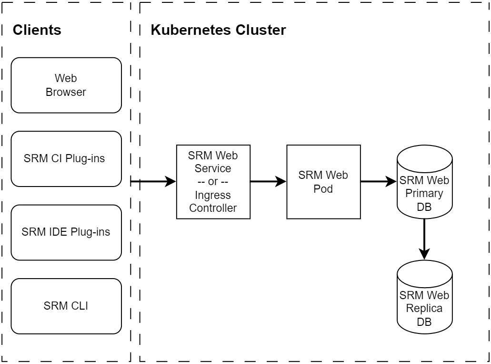

Every Software Risk Manager includes the web application that serves the web UI. Additional feature installation will depend on licensing and your Software Risk Manager use case.

## Scan Farm Feature

Deployments that include the Scan Farm feature have built-in SAST and SCA scanning provided by Coverity and Black Duck, respectively. They include additional pods that support scanning, caching, and storage with external dependencies on PostgreSQL (versions 10.16 - 14.x), Redis (version 5.0 or greater), and object storage provided by either GCP, AWS, Azure, or MinIO. You are responsible for configuring external dependencies according to our guidance.

Your Software Risk Manager licensing will determine whether you have SAST, SCA, or both SAST and SCA scanning capability. SCA scanning depends on an external Black Duck server instance hosted by Synopsys. You are not responsible for the configuration of this instance or for specifying its endpoint during the Software Risk Manager deployment process.

Scan Farm-related Docker images are unavailable in Docker Hub. You must pull them along with all other Software Risk Manager Docker images from the Synopsys Software Integrity Group repository (sig-repo.synopsys.com).

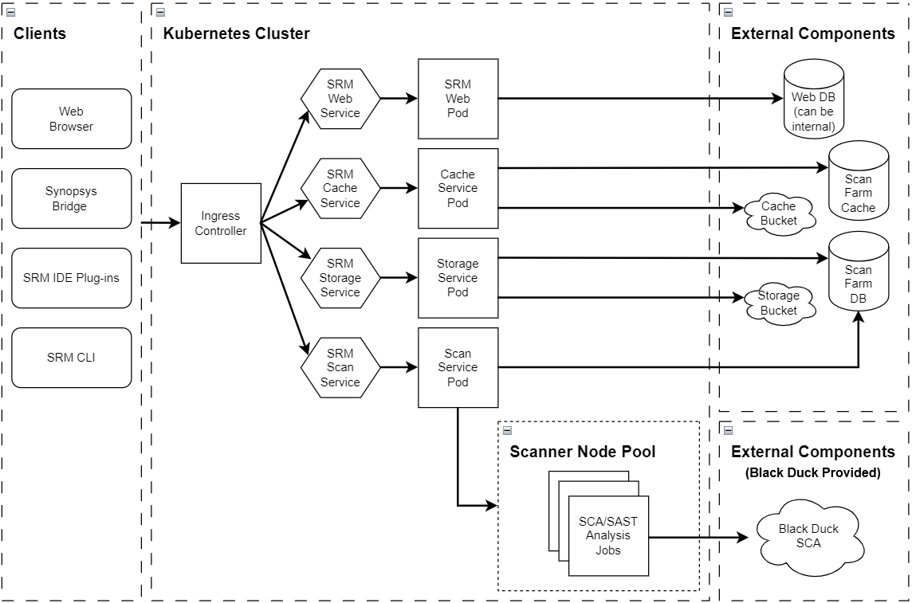

The Scan Farm includes an ingress resource for the following services: Storage Service, Cache Service, and Scan Service. The Storage Service provides access to externally provided object storage, the Cache Service provides an interface to an external cache, and the Scan Service provides the Tool API that lets clients download SAST and SCA tools.

The external, Synopsys-provided Black Duck SCA scanning endpoint will receive a Black Duck BDIO file used for Black Duck Rapid Scans. The file gets sent to a Synopsys Code Sight endpoint and is then handled by Black Duck server and Black Duck KnowledgeBase instances. For general [communication with Black Duck services](https://sig-product-docs.synopsys.com/bundle/bd-hub/page/Network_Communications/CommunicationWithBDServers.html) information, refer to the Black Duck documentation.

## Tool Orchestration Feature

Deployments that include the Tool Orchestration feature support orchestrated analyses that let you run both built-in and custom [add-ins](https://github.com/codedx/srm-add-ins) on your cluster. They have additional pods that support tool workflows and storage with an optional external dependency on object storage provided by a system with an AWS S3-compatible API (e.g., MinIO, AWS S3, GCS, etc.). 

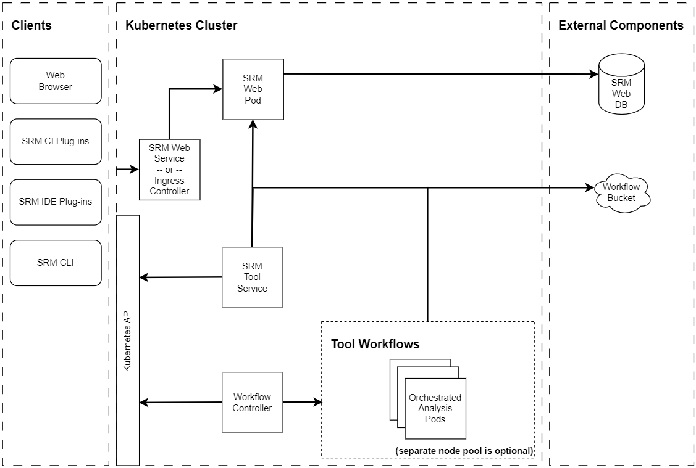

When not opting for external object storage, the Software Risk Manager Helm chart will configure an older MinIO version for you.

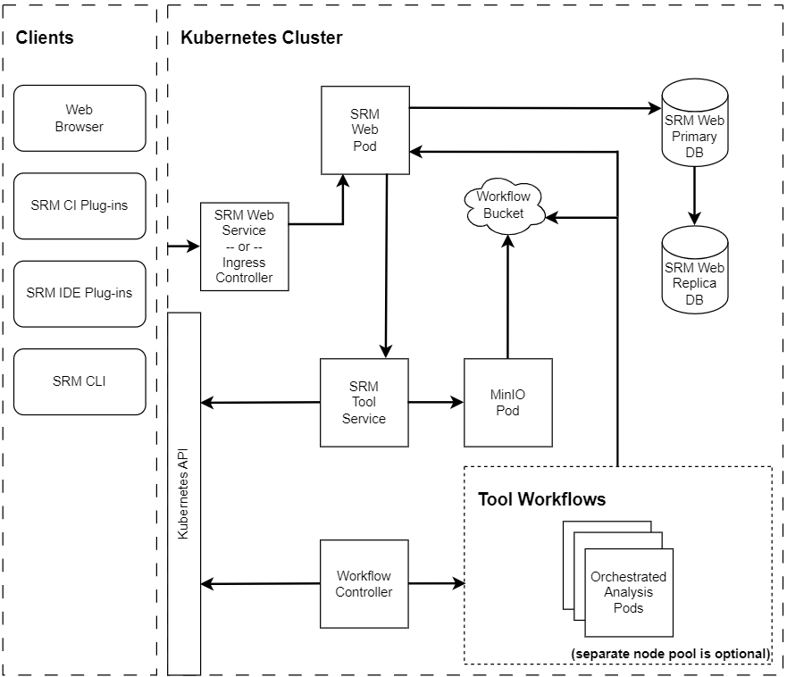

# Requirements

Refer to what follows for the supported or tested versions of software that comprise the Software Risk Manager deployment.

## Kubernetes Requirements

The Software Risk Manager deployment supports Kubernetes versions 1.22 through 1.28 and was tested with OpenShift 4.13.

## System Size

Although we often get asked what the hardware requirements are, there is no one answer since it largely depends on how many Software Risk Manager projects will be active at the same time, how frequently analyses will be conducted, whether built-in tools are being used, the number of results from tools in use, how many concurrent users are expected to use the system, and what other system interactions might be configured. Taking that into account, you can use some general guidelines to determine the size of your deployment.

| Size | Total Projects | Daily Analyses | Concurrent Analyses |
|:-|-:|-:|-:|
|Small|1 - 100|1,000|8|
|Medium|100 - 2,000|2,000|16|
|Large|2,000 - 10,000|10,000|32|
|Extra Large|10,000+|10,000+|64|

The Helm Prep Wizard (see [Full Installation](#installation---full)) includes a screen where you can specify the system size:

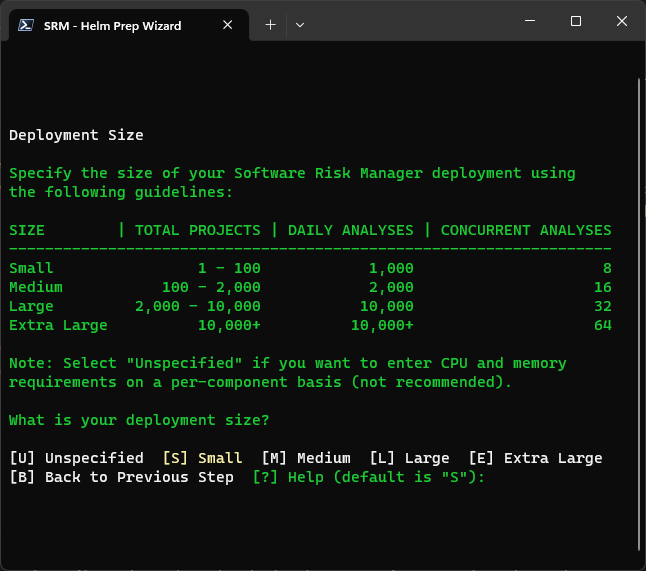

And the Helm Prep script will use the system size to set the `sizing.size` Helm values setting, and it will also configure any dependency charts according to the specified size. [Quick Starts](#installation---quick-start) use Unspecified, so they do not support automatic component sizing.

>Note: The system sizing capability does not apply to Scan Farm workloads.

The default system size is Unspecified. A system size specification will override most configurable resource requests. If you want to use specific resource requests, keep the `sizing.size` chart parameter at its default value.

## Core Feature Requirements

This section describes the web and web database requirements based on the system size.

### Core Web Workload Requirements

| Size | CPU Cores | Memory | IOPs | Storage |
|:-|-:|-:|-:|-:|
|Small|4|16 GB|3,000|64 GB|
|Medium|8|32 GB|6,000|128 GB|
|Large|16|64 GB|12,000|256 GB|
|Extra Large|32|128 GB|32,000|512 GB|

### Core Web Database Workload Requirements

| Size | CPU Cores | Memory | IOPs | Storage |
|:-|-:|-:|-:|-:|
|Small|4|16 GB|3,000|192 GB|
|Medium|8|32 GB|6,000|384 GB|
|Large|16|64 GB|12,000|768 GB|
|Extra Large|32|128 GB|32,000|1536 GB|

### Core Web Replica Database Workload Requirements

The replica database is an optional component when using the on-cluster MariaDB component.

| Size | CPU Cores | Memory | IOPs | Storage | Backup Storage |
|:-|-:|-:|-:|-:|-:|
|Small|2|8 GB|3,000|192 GB|576 GB|
|Medium|4|16 GB|6,000|384 GB|1152 GB|
|Large|8|32 GB|12,000|768 GB|2304 GB|
|Extra Large|16|64 GB|32,000|1536 GB|4608 GB|

### Core Persistent Storage Requirements

The Software Risk Manager web workload requires a Persistent Volume resource to store various files: the analysis inputs it receives, including the source code it displays on the Finding Details page, log files, and configuration files, to include data required to decrypt certain database records. By default, the volume will be provisioned dynamically at deployment time. The optional on-cluster MariaDB database usage determines whether additional, dynamically-provisioned Persistent Volume resources are needed.

| Volume | Feature | Description |
|:-|:-:|:-:|
| Web AppData | Core | Required volume for web workload |
| Primary DB Data | Core (w/ On-Cluster Database) | Database volume for primary database |
| Replica DB Data | Core (w/ On-Cluster Database) | Database volume for replica database |
| Replica DB Backup | Core (w/ On-Cluster Database) | Database volume for replica database backups |

### Core Internet Access Requirements

Software Risk Manager uses internet access in the background for some activities, such as keeping tool data up-to-date and periodically checking for a new Software Risk Manager release.

Software Risk Manager does not require internet access; however, internet access is highly recommended to ensure full functionality.

To disable background internet access by Software Risk Manager, [customize your Software Risk Manager deployment](#customizing-software-risk-manager-props) by setting `codedx.offline-mode = true`. The default is false. Note that this will not disable any internet access that may occur due to user action or configuration settings, such as Tool Connector, Git, or Issue Tracker configurations.

When internet access is enabled, Software Risk Manager will perform the following actions:

- Update notifications - Software Risk Manager will periodically check for newer versions and display an update notification when one is available. Requests for the latest version are sent to https://service.codedx.com/updates/latestVersionData.json.
- Dependency-Check updates - Dependency-Check will periodically download updates from the National Vulnerability Database, the Retire.js repository, or reach out to Maven Central while scanning Java dependencies (this aids in the dependency identification process, to cut down on both false positive and false negative results). 
- If Software Risk Manager is in offline mode, this may lead to lower quality results when running Dependency-Check as a bundled tool.
- Secure Code Warrior - Unless noted elsewhere, Software Risk Manager will reach out to any URLs belonging to the securecodewarrior.com domain.

### Core Pod Security Admission Requirements

When enforcing policy violations with the optional [Kubernetes Pod Security Admission](https://kubernetes.io/docs/concepts/security/pod-security-admission) feature, the Core feature requires the `baseline` level.

## Scan Farm Feature Requirements

This section covers the requirements you must satisfy with the external dependencies you provide for the database, cache, and object storage layers.

### Scan Farm Database Requirements

The Scan Farm feature depends on a PostgreSQL database supporting versions 10.16–14.5. Synopsys recommends using a DBaaS (database as a service) database. Configure your PostgreSQL database by reserving 1 CPU core and 2 GB RAM. The recommended database volume size is 5GB.

### Scan Farm Cache Requirements

Here are the requirements and recommendations for your Redis instance:

- Redis must be configured without eviction. You must ensure the Redis eviction policy is set to noeviction (maxmemory-policy=noeviction). The Cache Service design requires that all metadata be resident in Redis at all times. The Cache Service will refuse to start if Redis is not correctly configured.

- The Redis memory limit should be 1 GB. The Cache Service checks the memory usage of the Redis server at start-up and will not start if memory usage is more than 99% of the server limit.

- The Cache Service does not use Redis persistence; therefore, configure Redis without persistence. If persistence is enabled, the Redis pod memory limit must be significantly higher than the Redis server memory limit.

- Your Redis instance must permit network traffic from the Cache Service.

- Allocate 1 vCPU for on-cluster Redis workloads.

Synopsys recommends configuring your Redis instance with both authentication and TLS.

### Scan Farm Object Storage Requirements

The Scan Farm requires two buckets that must be created before deployment. A storage bucket would be considered a blob container when using Azure object storage.

The first bucket supports the Scan Service, and the second the Cache Service. The overall size requirements for Scan Service storage depend on scanning activity and retention period.

| Object Type | Average Size | Average Number of Scans | Retention Period | Total Average Size |
|:-|-:|-:|-:|-:|
| Scan Objects | M GB | N | T days | (M \* N \* T) GB |
| Client CLI Tools | 10 GB | n/a | 1 Release | 10 GB |
| Logs | 500 MB | n/a | T days | T/2 GB |

For example, if:
M = 0.25 GB per scan
N = 100 scans per day
T = 30-day retention period
CLI tools use 10 GB in total
Logs are .5 GB each
Using the equation: (M \* N \* T) GB + 10GB + T/2 GB

The total Scan Service storage bucket size is 750 GB (scan objects) + 10 GB (CLI tools) + 15 GB (logs) = 775 GB

The Cache Service bucket should not be geographically distributed and should not enable versioning, retention, or other special features. 

You must configure your Cache Service bucket with an object expiration greater than (not equal to) 7 days. When creating a life cycle policy on Azure, define the policy using the last modified date, not the creation date. The Cache Service checks that this lifecycle rule is present and will not start if a lifecycle policy retention period is not set.

Both buckets must support read/write access from the Cache Service and Storage Service. Additionally, the Cache Service must have permission to download the cache bucket's lifecycle policy. For example, with storage that supports the S3 API, the Cache Service will use the GetBucketLifecycleConfiguration API, which requires the s3:GetLifecycleConfiguration permission.

### Scan Farm Node Pool Requirements

The Scan Farm requires a separate node pool that supports nodes with 6.5 vCPUs and 26 GB of RAM. Meeting this requirement in your infrastructure might require a node pool of 8 vCPU and 32 GB RAM nodes. The nodes must include a Kubernetes taint for NodeType​=​​ScannerNode and a label of pool-type​=​small. A SAST analysis will consume a single node, so you should configure your node pool to scale horizontally as your scanning workload requires.

### Scan Farm Private Registry

When you enable the Scan Farm feature, you must pull Software Risk Manager Docker images from the Synopsys SIG (Software Integrity Group) private Docker registry (SIG repo) and push them to your private registry. This includes the Docker images for all the features you plan to install, not just Scan Farm-related ones. 

You can use a private registry hosted by a cloud provider (e.g., AWS, GCP, Azure, etc.) or deploy your own (see https://github.com/synopsys-sig/srm-k8s/blob/main/docs/deploy/registry.md for details).

### Scan Farm Ingress Requirements

The Scan Farm feature requires you to use an ingress controller, and your ingress controller must support multiple ingress resources referencing the same hostname. Synopsys recommends the [NGINX Community](https://kubernetes.github.io/ingress-nginx/) ingress controller. You can find the Installation Guide [here](https://kubernetes.github.io/ingress-nginx/deploy/).

### Scan Farm Internet Access Requirements

SCA scanning depends on an external Black Duck system hosted by Synopsys at `https://codesight.synopsys.com`. SCA scans will fail if this endpoint is inaccessible from your cluster.

The Scan Service also depends on the Synopsys SIG Repo hosted at sig-repo.synopsys.com. The service downloads Scan Farm components at boot time and will not work correctly without a SIG Repo connection.

### Scan Farm Default Pod Resources

Below are the default CPU and memory assigned to Scan Farm pods.

| Pod | CPU | Memory |
|:-|:-:|:-:|
| Scan Service      | 100m  | 128Mi   |
| Cache Service     | 500m  | 1000Mi  |
| Storage Service   | 100m  | 128Mi   |
| Coverity Scan Job | 6500m | 26000Mi |
| SCA Scan Job      | 1500m | 1500Mi  |

>Note: The SCA Scan Job resources are fixed at 1.5 vCPUs and 1500Mi of memory. You cannot currently change the resource limits for SCA scan pods.

## Tool Orchestration Feature Requirements

The initial MinIO volume size should be 64 GB when not using external object storage. External object storage can be provided by any storage system that supports an AWS S3-compliant API (e.g., AWS, GCP, MinIO, etc.).

### Tool Service Workload Requirements

| Size | CPU Cores | Memory | Replicas
|:-|-:|-:|-:|
|Small|1|1024 Mi|1|
|Medium|2|2048 Mi|2|
|Large|2|2048 Mi|3|
|Extra Large|2|2048 Mi|4|

### Workflow Controller Workload Requirements

| Size | CPU Cores | Memory
|:-|-:|-:|
|Small|.5|500 Mi|
|Medium|1|1000 Mi|
|Large|2|1500 Mi|
|Extra Large|4|2000 Mi|

### On-Cluster Workflow Storage Requirements (MinIO)

The MinIO pod is not applicable when using external workflow object storage (e.g., AWS S3).

| Size | CPU Cores | Memory | Storage
|:-|-:|-:|-:|
|Small|2|5120 Mi|64 GB|
|Medium|4|10240 Mi|128 GB|
|Large|8|20480 Mi|256 GB|
|Extra Large|16|40960 Mi|512 GB|

### Add-in Tool Workload Requirements

Deployments that include the Tool Orchestration feature support orchestrated analyses that let you run both built-in and custom [add-ins](https://github.com/codedx/srm-add-ins) on your cluster. Refer to the [Tool Orchestration Add-in Resource Requirements](#tool-orchestration-add-in-resource-requirements) section for add-in tool pod resources that you can set on a global, tool, project, or project tool basis.

By default, add-in tools use a 500m CPU request with a 2000m CPU limit and make a request for 500Mi memory with a 2G limit.

### Tool Orchestration Persistent Storage Requirements

When using Tool Orchestration without external object storage, a single, dynamically-provisioned Persistent Volume resource is required for orchestrated analysis workflow storage, including analysis inputs, results, and related tool log files. Refer to the [On-Cluster Workflow Storage Requirements](#on-cluster-workflow-storage-requirements) section for default volume capacity based on system size.

By default, Software Risk Manager will automatically remove old analyses and related storage from the tool service. Related tool results and findings will be retained when workflow storage gets cleaned up. Workflow cleanup is enabled by default, allowing storage for 100 completed analyses to exist in a success or failure state, with a maximum of five completed analyses per project.

Additional analyses beyond the limits will remove the storage for the oldest analysis. To adjust workflow cleanup behavior, [customize your Software Risk Manager deployment](#customizing-software-risk-manager-props) by setting these parameters:

```
- tws.storage.cleanup.enabled = true
- tws.storage.cleanup.max-total-analyses = 100
- tws.storage.cleanup.max-analyses-per-project = 5
```

You can use this expression to estimate your maximum workflow storage requirement:

```
(tws.storage.cleanup.max-total-analyses * average-analysis-input-size) +
(tws.storage.cleanup.max-total-analyses * average-analysis-result-size) +
(tws.storage.cleanup.max-total-analyses * average-tool-log-size)
```

You can use this expression to estimate your workflow storage requirement for completed analyses when the total analysis count is less than tws.storage.cleanup.max-total-analyses:

```
(tws.storage.cleanup.max-analyses-per-project * project-count * average-analysis-input-size) +
(tws.storage.cleanup.max-analyses-per-project * project-count * average-analysis-result-size) +
(tws.storage.cleanup.max-analyses-per-project * project-count * average-tool-log-size)
```

### Tool Orchestration Add-in Resource Requirements

Software Risk Manager can create orchestrated analyses that run one or more application security testing tools where each tool has access to its host's memory and CPU resources. Using Kubernetes tools, you can control the memory and CPU capacity available for analyses. You can also improve Kubernetes scheduling outcomes by requesting CPU or memory capacity for specific tools or projects. Resource requirements can also include a node selector and pod toleration, with taint effects NoSchedule and NoExecute, to influence further where tools run on your cluster.

The resource requirements feature cannot be configured using the Software Risk Manager user interface, but you can use the kubectl command to define configuration maps (ConfigMaps) that cover specific scopes determined by a special naming convention. The tool service will look for and read optional ConfigMaps to determine how resource requirements apply to a particular tool run.

Resource requirements containing CPU and memory instructions translate to Kubernetes resource requests and limits and fit with any other related Kubernetes configuration, such as a resource limit defined for a Kubernetes namespace. You can specify resource requirement data by using the following ConfigMap field names:

- requests.cpu – Kubernetes CPU request (e.g., 1).
- requests.memory – Kubernetes memory request (e.g., 1G).
- limits.cpu – Kubernetes CPU limit (e.g., 2).
- limits.memory – Kubernetes memory limit (e.g., 2G).
- nodeSelectorKey – key portion of a label associated with a node selector (e.g., purpose).
- nodeSelectorValue – value portion of a label associated with a node selector.
- podTolerationKey – key portion of a taint with the NoSchedule and NoExecute taint effects (e.g., dedicated).
- podTolerationValue – value portion of a taint with the NoSchedule and NoExecute taint effects (e.g., tools).

Below are the default CPU and memory settings for add-in tools. Refer to the [Tool Orchestration Add-in Tool Configuration](#tool-orchestration-add-in-tool-configuration) section for how to customize resource requirements for your Software Risk Manager deployment.

| Resource | Request | Limit |
|:-|:-:|:-:|
| CPU | 500m | 2000m |
| Memory | 500Mi | 2G |

>Note: There are no defaults for add-in node selectors and pod tolerations.

### Tool Orchestration Pod Security Admission Requirements

When enforcing policy violations with the optional [Kubernetes Pod Security Admission](https://kubernetes.io/docs/concepts/security/pod-security-admission) feature, the Tool Orchestration feature requires the `privileged` level.

# External Web Database Pre-work

Software Risk Manager includes a MariaDB database that requires no configuration on your part. You can skip this section if you plan to use the on-cluster database instance.

If you prefer an external database, the web workload supports MariaDB version 10.6.x and MySQL version 8.0.x. Complete the following pre-work before installing Software Risk Manager with an external web database.

Your MariaDB/MySQL database must include the following variable configuration.

- optimizer_search_depth=0
- character_set_server=utf8mb4
- collation_server=utf8mb4_general_ci
- lower_case_table_names=1
- log_bin_trust_function_creators=1

The log_bin_trust_function_creators parameter is required when using replication, enabled by default with the AWS MariaDB/MySQL Production template.

If you are using a database instance hosted by AWS, Azure, or GCP, refer to [how to create a new AWS parameter group](https://docs.aws.amazon.com/AmazonRDS/latest/UserGuide/USER_WorkingWithParamGroups.html), [how to configure Azure Database for MySQL parameters](https://learn.microsoft.com/en-us/azure/mysql/single-server/how-to-server-parameters), or [how to configure GCP Cloud SQL MySQL database flags](https://cloud.google.com/sql/docs/mysql/flags).

Refer to the Web Database Workload Requirements section for database instance configuration details. You must pre-create the database catalog and the Software Risk Manager database user with the following steps.

>Note: If you have to reinstall Software Risk Manager and purge your Software Risk Manager data, you must repeat Steps 2 and 3 after deleting your Software Risk Manager Persistent Volume.

1. Create a database user. You can customize the following statement to create a user named "srm," remove 'REQUIRE SSL' when not using TLS (your database instance may require transport security).

   CREATE USER 'srm'@'%' IDENTIFIED BY 'enter-a-password-here' REQUIRE SSL;

2. Create a database catalog. The following statement creates a catalog named srmdb.

   CREATE DATABASE srmdb;

3. Grant required privileges on the database catalog to the database user you created. The following statements grant permissions to the srm database user.

   GRANT SELECT, INSERT, UPDATE, DELETE, CREATE, CREATE TEMPORARY TABLES, ALTER, REFERENCES, INDEX, DROP, TRIGGER ON srmdb.* to 'srm'@'%';
   FLUSH PRIVILEGES;

4. If your database configuration requires Software Risk Manager to trust a certificate (e.g., the [Amazon RDS root certificate](https://s3.amazonaws.com/rds-downloads/rds-ca-2019-root.pem)), download the certificate to make it available later in the Helm Prep Wizard.

# Persistent Storage Pre-work

Software Risk Manager depends on one or more Persistent Volume resources, depending on the features you install and how you configure them. You will always have at least one volume for the Core feature's web component. Dynamic volume provisioning is required by default. Refer to the following sections for Kubernetes provider-specific instructions.

## Volume Configuration Pre-work

Consider using Persistent Volumes with a [Retain reclaim policy](https://kubernetes.io/docs/concepts/storage/persistent-volumes/#retain). Volumes associated with a [Delete reclaim policy](https://kubernetes.io/docs/concepts/storage/persistent-volumes/#delete) will be lost if a Persistent Volume Claim is inadvertently deleted. Dynamic volume provisioning will use the [reclaim policy](https://kubernetes.io/docs/concepts/storage/storage-classes/#reclaim-policy) specified by the [storage class](https://kubernetes.io/docs/concepts/storage/storage-classes/#the-storageclass-resource).

>Note: You can edit Persistent Volume resources to change the retention policy of existing volumes.

Should volume resizing be necessary in the future, consider using Persistent Volumes that [allow volume expansion](https://kubernetes.io/docs/concepts/storage/storage-classes/#allow-volume-expansion).

## AWS Persistent Storage Pre-work

Software Risk Manager supports EBS and EFS storage volumes for the web workload. Do not use AWS EFS for database-related volumes.

### AWS EBS Persistent Storage Pre-work

If you plan to use AWS EBS storage, install the [AWS EBS CSI Driver EKS Addon](https://docs.aws.amazon.com/eks/latest/userguide/eks-add-ons.html) before continuing.

### AWS EFS Persistent Storage Pre-work

This section describes using AWS EFS storage for your Software Risk Manager Web volume. The AWS EFS CSI driver supports dynamic provisioning. This example uses static provisioning and demonstrates how the Software Risk Manager chart can reference a bound Persistent Volume Claim resource.

>Note: These steps assume that you are using the Software Risk Manager Core feature with an external database. 

1) Create and configure an [EFS filesystem](https://aws.amazon.com/pm/efs). Ensure that available network mounts exist in each Availability Zone before continuing and that inbound network rules permit network traffic on port 2049 from your cluster workloads.

2) Install the [AWS EFS CSI Driver EKS Addon](https://docs.aws.amazon.com/eks/latest/userguide/eks-add-ons.html)

3) Save this StorageClass content to a file named efs-storageclass.yaml:

```
kind: StorageClass
apiVersion: storage.k8s.io/v1
metadata:
  name: efs-sc
provisioner: efs.csi.aws.com
```

4) Create the StorageClass resource with the following command:

```
kubectl apply -f ./efs-storageclass.yaml
```

5) Replace the \<volume-handle-id\> (e.g., fs-07b385603296a82db) placeholder and save the below YAML to a file named srm-web-appdata-pv.yaml:

```
apiVersion: v1
kind: PersistentVolume
metadata:
  name: srm-web-appdata
spec:
  capacity:
    storage: 1Gi
  volumeMode: Filesystem
  accessModes:
    - ReadWriteMany
  persistentVolumeReclaimPolicy: Retain
  storageClassName: efs-sc
  csi:
    driver: efs.csi.aws.com
    volumeHandle: <volume-handle-id>
```

6) Create the PersistentVolume resource with the following command:

```
kubectl apply -f ./srm-web-appdata-pv.yaml
```

7) Create the Software Risk Manager namespace, replacing the namespace name as necessary:

```
kubectl create ns srm
```

8) Save this PersistentVolumeClaim content to a file named srm-web-appdata-pvc.yaml, replacing the namespace name as necessary:

```
apiVersion: v1
kind: PersistentVolumeClaim
metadata:
  name: srm-web-appdata
  namespace: srm
spec:
  accessModes:
    - ReadWriteMany
  storageClassName: efs-sc
  resources:
    requests:
      storage: 1Gi
```

9) Create the PersistentVolumeClaim resource with the following command:

```
kubectl apply -f ./srm-web-appdata-pvc.yaml
```

10) Wait for the PersistentVolumeClaim to reach a Bound status, check by periodically running the following command, replacing the namespace name as necessary:

```
kubectl -n srm get pvc srm-web-appdata
```

11) Save this Job content to a file named srm-web-appdata-job.yaml, replacing the namespace name as necessary:

```
apiVersion: batch/v1
kind: Job 
metadata:
  name: srm-web-appdata
  namespace: srm
spec:
  template:
    spec:
      containers:
      - name: srm-web-appdata
        image: busybox
        command: ["/bin/sh"]
        args: ["-c", "cd /data && chmod 2775 . && chown root:1000 ."]
        volumeMounts:
        - name: srm-web-appdata-storage
          mountPath: /data
      restartPolicy: Never
      volumes:
      - name: srm-web-appdata-storage
        persistentVolumeClaim:
          claimName: srm-web-appdata
```

12) Create the Job resource with the following command:

```
kubectl apply -f ./srm-web-appdata-job.yaml
```

13) Wait for the Job to complete, check by periodically running the following command, replacing the namespace name as necessary:

```
kubectl -n srm get job srm-web-appdata
```

14) If you already have an srm-extra-props.yaml file, merge the below content into your existing file. Otherwise, create your srm-extra-props.yaml file (see [Customizing Software Risk Manager (props)](#customizing-software-risk-manager-props)) and add the following content:

```
web:
  persistence:
    existingClaim: srm-web-appdata
```

15) Refer to [Customizing Software Risk Manager (props)](#customizing-software-risk-manager-props) for how to rerun helm with your srm-extra-props.yaml file.
 
# Scan Farm Pre-work

Software Risk Manager does not include the dependencies required for the Scan Farm features. You can skip this section if you do not plan to use the Scan Farm feature. Complete the following pre-work before installing the Scan Farm.

## Private Docker Registry

When using the Scan Farm feature, you must have access to a private registry where you will store Software Risk Manager Docker images. Determine whether your private registry requires a Kubernetes Image Pull Secret. Your private registry may not require an explicit username and password if your cluster's configuration already includes access. If you need a registry credential, identify the username and password, but do not pre-create the Kubernetes Image Pull Secret.

Determine whether you will use a prefix for repositories added to your private registry. Your registry may require one, or you may create one to simplify pushing Docker images by pre-creating a single repository. For example, if you use Google Cloud Platform Artifact Registry in the us-central1 region, your registry host will be us-central1-docker.pkg.dev, but your repository prefix could be my-gcp-project-name/srm (assuming a GCP project named "my-gcp-project-name"). In that case, you should pre-create the srm repository before pushing Docker images from SIG repo to us-central1-docker.pkg.dev/my-gcp-project-name/srm.

You can find instructions for pulling the latest Software Risk Manager Docker images for Scan Farm deployments [here](deploy/registry.md).

## AWS Scan Farm Pre-work

You can satisfy Scan Farm feature dependencies with AWS services.

### EKS Scanner Nodes Pre-work

Create a new [EKS node group](https://docs.aws.amazon.com/eks/latest/userguide/create-managed-node-group.html) for your Scan Farm nodes. Select an instance type that includes 8 vCPUs and 32 GiB of RAM. 

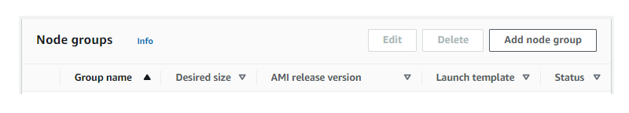

In the "Kubernetes label" section, add a label with Key=pool-type and Value=small.

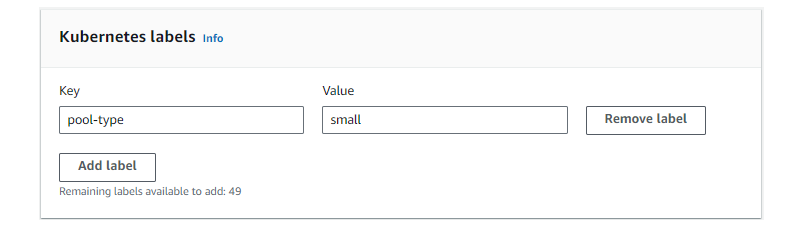

In the "Kubernetes taint" section, add a taint with Key=NodeType, Value=ScannerNode, and Effect=NoSchedule.

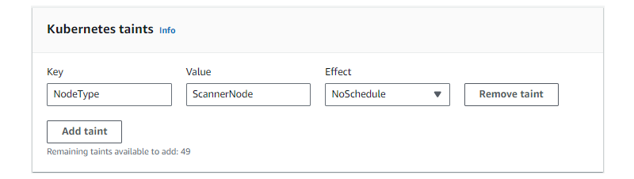

### RDS for PostgreSQL (Database) Pre-work

Create a new [RDS for PostgreSQL database](https://aws.amazon.com/rds/postgresql) instance to host the Scan Farm's database catalogs for the Scan Service and Storage Service.

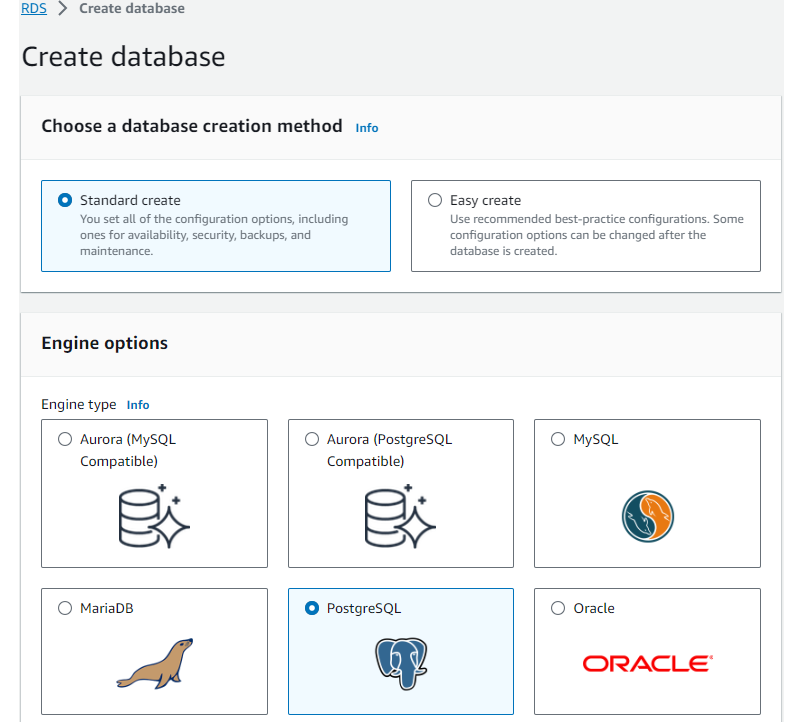

Allocate storage capacity and specify an instance size that meets the CPU and memory requirements in the Scan Farm Database Requirements section.

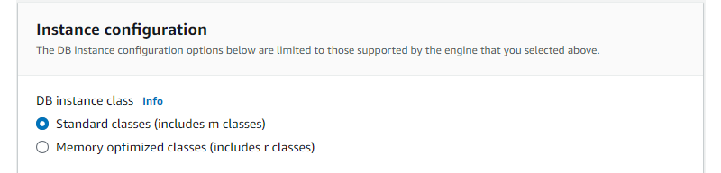

Your PostgreSQL database instance must permit network traffic from the Storage Service and Scan Service pods. For example, if your database is in the same VPC as your EKS cluster, update your RDS security group by adding your EKS cluster security group.

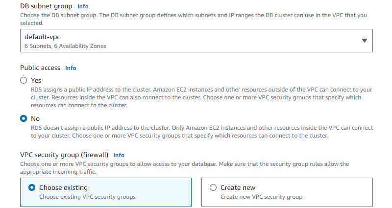

### ElastiCache for Redis (Cache) Pre-work

You will create a new [ElastiCache for Redis](https://aws.amazon.com/elasticache/redis) instance to host the Scan Farm cache. First you must create a custom parameter group to apply required settings to your cluster.

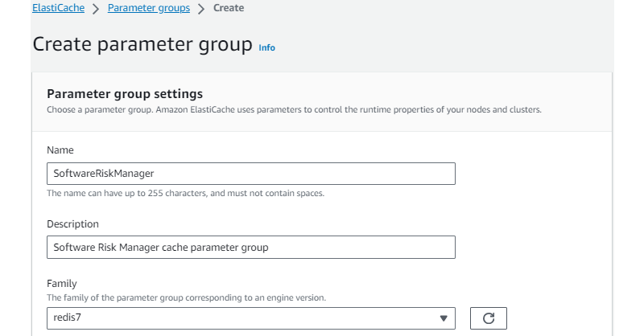

Specify "noeviction" for the maxmemory-policy parameter. The Cache Service will fail to start with the default value for maxmemory-policy.

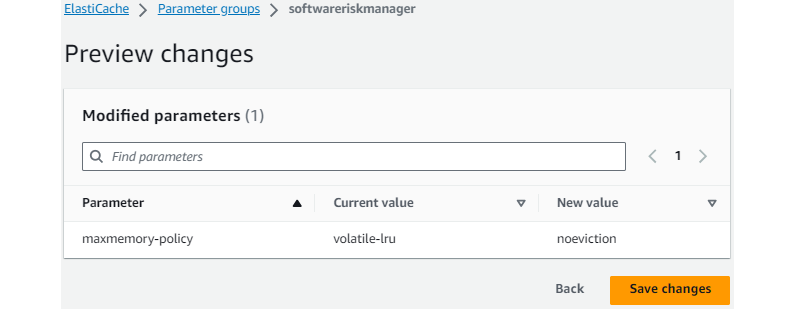

Create a new Redis cluster using an option where you can specify your parameter group and choose your instance size.

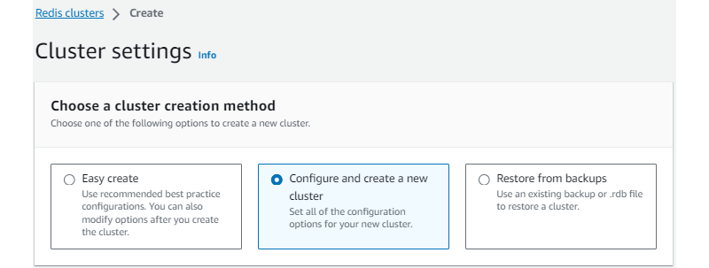

The memory limit should be 1 GB, however, this should be adjusted based on your requirements. The Cache Service checks the memory usage of the Redis server at start-up and will not start if memory usage is more than 99% of the server limit.

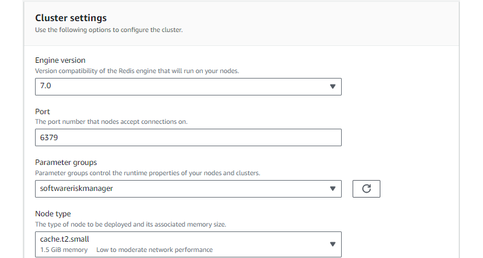

Your cache instance must permit network traffic from the Cache Service pod.

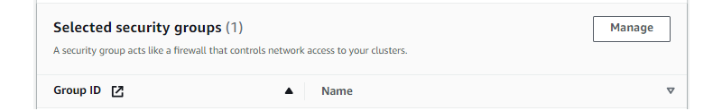

Consider enabling authentication and TLS for your cache instance. If you enable TLS, you must download the certificate file for your Redis instance. Running openssl with the s_client parameter from a system with cache connectivity is one way to obtain your Redis certificate file.

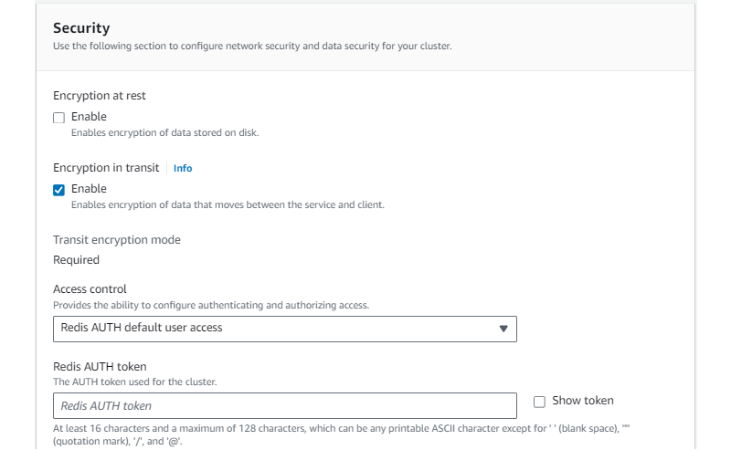

### Simple Storage Service (Object Storage) Pre-work

Create two new [Simple Storage Service](https://aws.amazon.com/s3) buckets, one for the Storage Service and one for the Cache Service.

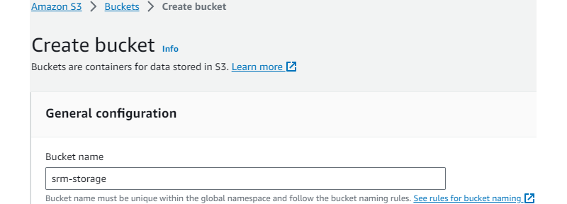

After creating the cache bucket, open the bucket details page.


You must define a cache bucket lifecycle policy with an object expiration greater than (not equal to) 7 days. The Cache Service checks that this lifecycle rule is present and will not start if a lifecycle policy retention period is not set. The bucket details screen allows you to create a new lifecycle policy rule. Define a new "Delete object" rule that expires current versions of objects after 8 days or more.

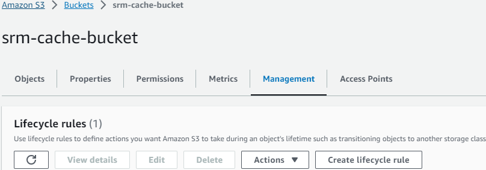

Ensure that the Cache Service and Storage Service have network connectivity to their buckets.

Software Risk Manager requires read/write bucket access, and access to the cache bucket's lifecycle policy is required (s3:GetLifecycleConfiguration permission). You can use an AWS account's access and secret key or you can configure [AWS IAM Roles for Service Account](https://docs.aws.amazon.com/eks/latest/userguide/iam-roles-for-service-accounts.html) to link an IAM role to a Kubernetes service account that the Cache Service and Storage Service will use for bucket access.

## GCP Scan Farm Pre-work

You can satisfy Scan Farm feature dependencies with GCP services.

### GKE Scanner Nodes Pre-work

Create a new [GKS node pool](https://cloud.google.com/kubernetes-engine/docs/how-to/node-pools) for your Scan Farm nodes. Select an instance type that includes 8 vCPUs and 32 GiB of RAM. 

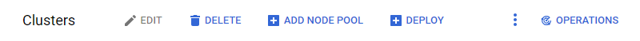

Visit the "Metadata" page before clicking "Create" to generate your node pool. In the "Kubernetes labels" section (not the "Labels" section), click "ADD KUBERNETES LABEL" and specify Key=pool-type and Value=small.

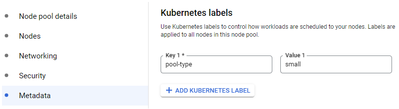

 In the "Node taints" section, click "ADD TAINT" and specify Key=NodeType, Value=ScannerNode, and Effect=NoSchedule.

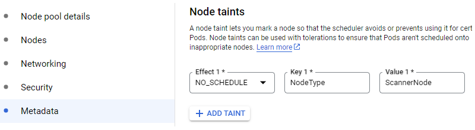

### Cloud SQL for PostgreSQL (Database) Pre-work

Create a new [PostgreSQL database](https://cloud.google.com/sql/docs/postgres) instance to host the Scan Farm's database catalogs for the Scan Service and Storage Service.


Allocate storage capacity and specify an instance size that meets the CPU and memory requirements in the Scan Farm Database Requirements section.

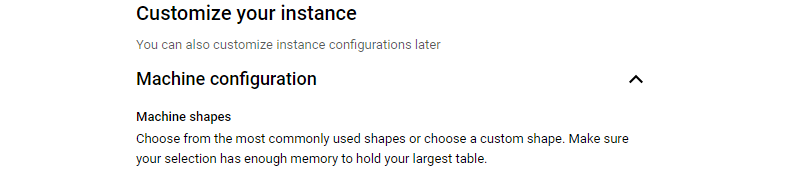

Your PostgreSQL database instance must permit network traffic from the Storage Service and Scan Service pods.

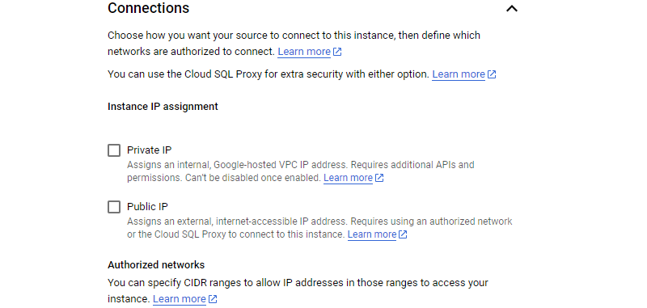

### Memorystore for Redis (Cache) Pre-work

Create a new [Memorystore for Redis](https://cloud.google.com/memorystore) instance to host the Scan Farm cache.

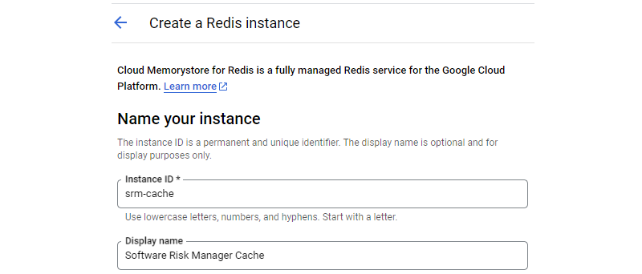

The memory limit should be 1 GB, however, this should be adjusted based on your requirements. The Cache Service checks the memory usage of the Redis server at start-up and will not start if memory usage is more than 99% of the server limit.


Your cache instance must permit network traffic from the Cache Service pod.

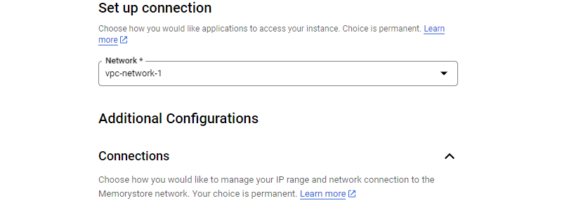

Your instance must include a maxmemory-policy that is set to noeviction. The Cache Service design requires that all metadata be resident in Redis at all times. The Cache Service will refuse to start if Redis is not correctly configured.

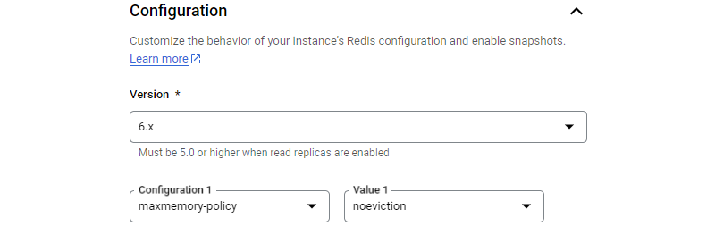

Consider enabling authentication and TLS for your cache instance.

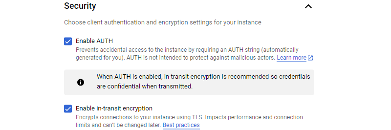

If you enable TLS, open your instance configuration details and download the instance's CA certificate from the TLS Certificate Authority section of the Security page.

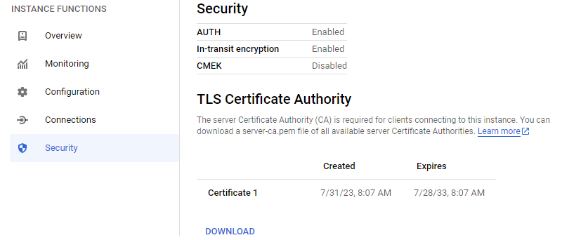

### Cloud Storage (Object Storage) Pre-work

Create two new [Cloud Storage](https://cloud.google.com/storage) buckets, one for the Storage Service and one for the Cache Service.


After creating the cache bucket, open the bucket details page.

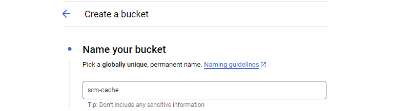

You must define a cache bucket lifecycle policy with an object expiration greater than (not equal to) 7 days. The Cache Service checks that this lifecycle rule is present and will not start if a lifecycle policy retention period is not set. The bucket details screen allows you to create a new lifecycle policy rule. Define a new "Delete object" rule that uses an "Age" condition to remove objects older than 8+ days. 

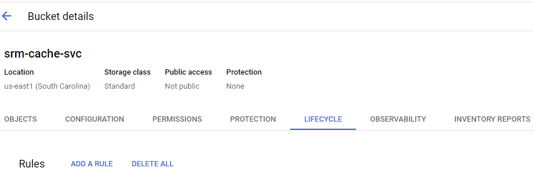

Ensure that the Cache Service and Storage Service have network connectivity to their buckets. Software Risk Manager requires read/write bucket access, and access to the cache bucket's lifecycle policy is required. Grant bucket permission to a GCP service account that the Software Risk Manager will use for bucket access.


Create a new JSON key for the GCP service account with bucket access.

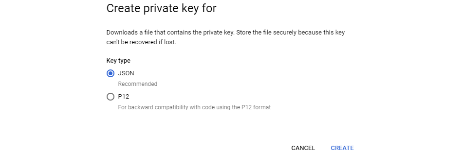

## Azure Scan Farm Pre-work

You can satisfy Scan Farm feature dependencies with Azure services. 

### AKS Scanner Nodes Pre-work

Create a new [AKS node pool](https://learn.microsoft.com/en-us/azure/aks/create-node-pools) for your Scan Farm nodes. Select an instance type that includes 8 vCPUs and 32 GiB of RAM. 

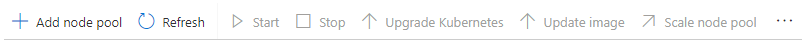

Visit the "Optional settings" page before clicking "Review + Create" to generate your node pool. In the "Labels" section, specify Key=pool-type and Value=small.

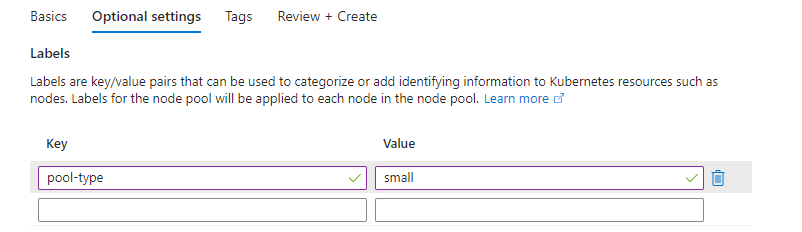

In the "Taints" section, specify Key=NodeType, Value=ScannerNode, and Effect=NoSchedule.

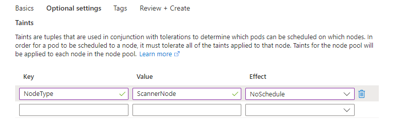

### Azure Database for PostgreSQL (Database) Pre-work

Create a new [PostgreSQL database](https://azure.microsoft.com/en-us/products/postgresql) instance to host the Scan Farm's database catalogs for the Scan Service and Storage Service.

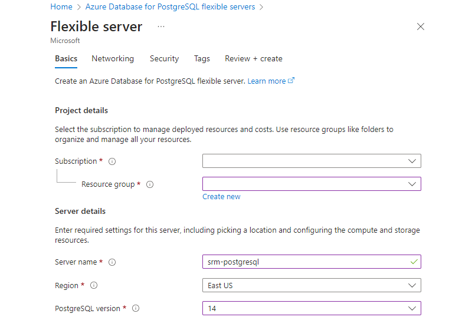

Allocate storage capacity and specify an instance size that meets the CPU and memory requirements in the Scan Farm Database Requirements section.


Your PostgreSQL database instance must permit network traffic from the Storage Service and Scan Service pods.

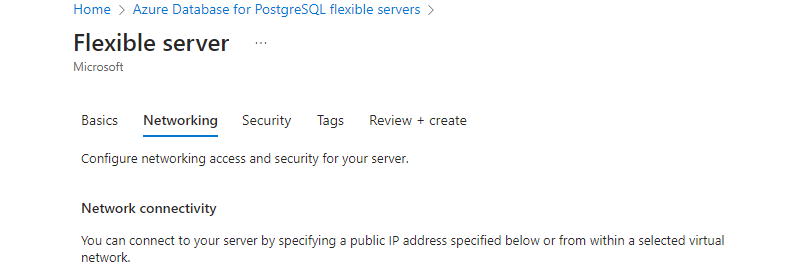

### Azure Cache for Redis (Cache) Pre-work

You will create a new [Azure Cache for Redis](https://azure.microsoft.com/en-us/products/cache/) instance to host the Scan Farm cache. The memory limit should be 1 GB, however, this should be adjusted based on your requirements. The Cache Service checks the memory usage of the Redis server at start-up and will not start if memory usage is more than 99% of the server limit.

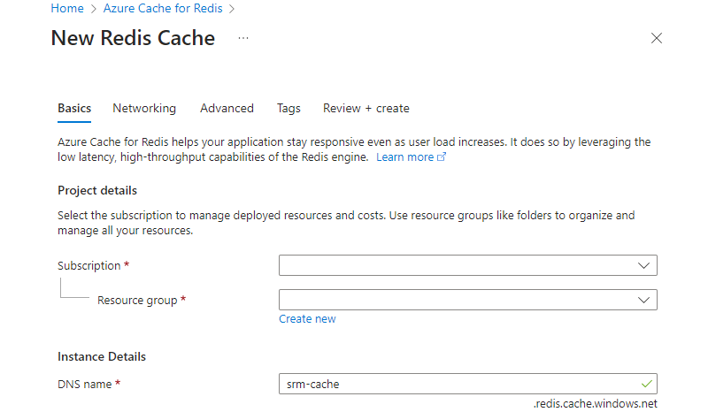

Your cache instance must permit network traffic from the Cache Service pod.

Your instance must include a maxmemory-policy that is set to noeviction. The Cache Service design requires that all metadata be resident in Redis at all times. The Cache Service will refuse to start if Redis is not correctly configured.

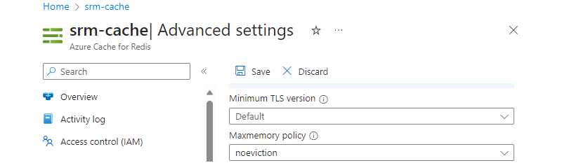

Your instance must include a maxmemory-policy that is set to noeviction. The Cache Service design requires that all metadata be resident in Redis at all times. The Cache Service will refuse to start if Redis is not correctly configured.

You can obtain your Redis key by clicking the "Access keys" link for your Azure Cache for Redis instance.

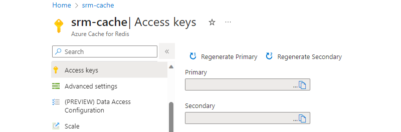

Your Azure Cache for Redis will use a certificate issued by DigiCert Global G2 CA Root ([as of May 2022](https://learn.microsoft.com/en-us/azure/azure-cache-for-redis/cache-whats-new#tls-certificate-change)). You can find Azure certificates [here](https://learn.microsoft.com/en-us/azure/security/fundamentals/azure-ca-details).

### Azure Cloud Storage (Object Storage) Pre-work

>Note: Scan Farm support for Azure object storage will be available with SRM 2023.12.0.

Create a new [Azure Storage Account](https://learn.microsoft.com/en-us/azure/storage/common/storage-account-create) to host two containers, one for the Storage Service and one for the Cache Service.

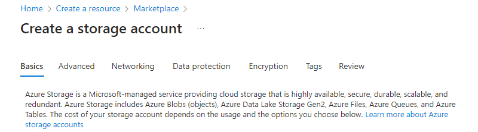

The storage account name you specify will become part of the URL used to access your storage containers.


Create a [blob container](https://learn.microsoft.com/en-us/azure/storage/blobs/blob-containers-portal) in your storage account for the Storage Service.

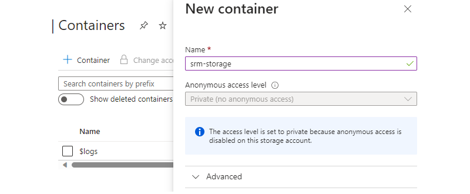

Create a second [blob container](https://learn.microsoft.com/en-us/azure/storage/blobs/blob-containers-portal) in your storage account for the Cache Service.


You must define a storage account lifecycle policy that deletes cache container blobs greater than (not equal to) 7 days old. The Cache Service checks that this lifecycle rule is present and will not start if a lifecycle policy retention period is not set. Create a new [Lifecycle management policy](https://learn.microsoft.com/en-us/azure/storage/blobs/lifecycle-management-policy-configure) for your storage account. The lifecycle management rule must specify a rule scope that uses a filter set to limit scope to the cache blob.

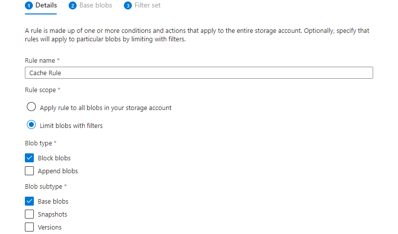

Set the if-then rule to delete blobs whose last modified date is 8 days or older. Define the policy using Last modified (the Cache Service validation will not accept a policy based on Created).

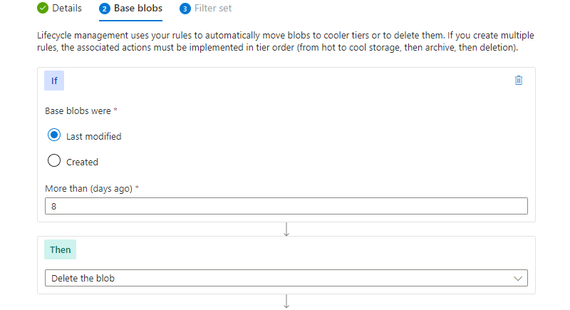

The lifecycle rule should not apply to the Storage Service blob container, so enter your Cache Storage blob container name as the Blob prefix of your filter set.

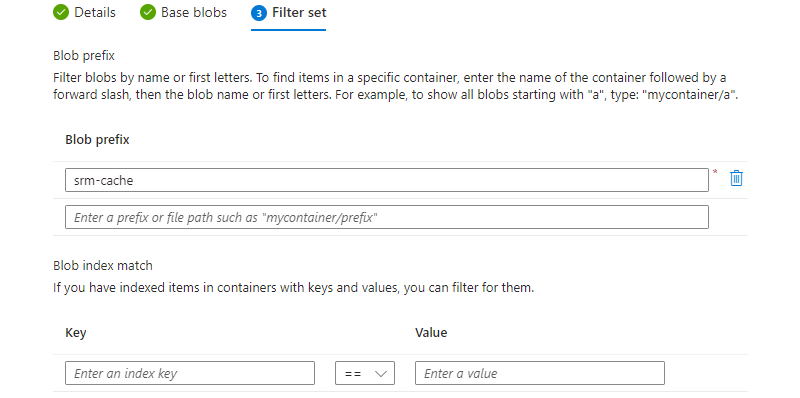

To configure Azure object storage, you will need the following information:

- Subscription ID
- Tenant ID
- Storage Account Azure Resource Group
- Storage Account Name
- Storage Account Access Key
- Storage Account Endpoint
- Azure Microsoft Entra ID Application (client) ID
- Azure Microsoft Entra ID Client Secret

>Note: Microsoft Entra ID is the new name for Azure Active Directory.

You can find your subscription ("id" field) and tenant identifiers ("tenantId" field) using the following command.

```
az account show
```

You can obtain your Storage Account Access Key by clicking the "Access keys" link for your storage account.

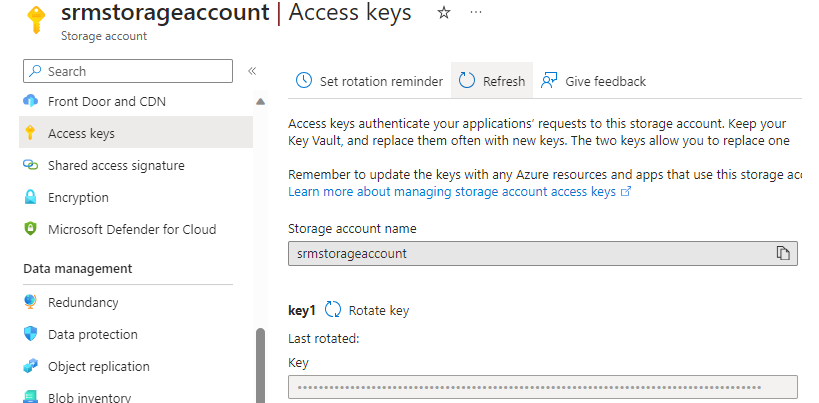

You can obtain your Storage Account Endpoint by clicking the "Endpoints" link for your storage account. The "Blob service" field contains your endpoint.

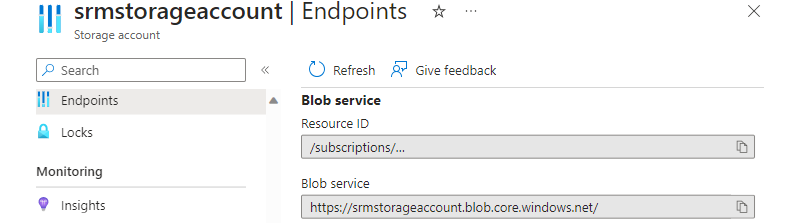

The Scan Farm depends on a [Microsoft Entra ID app registration](https://learn.microsoft.com/en-us/azure/active-directory/develop/app-objects-and-service-principals) with read/write access to your Azure storage containers. You must register a new application with Microsoft Entra ID.

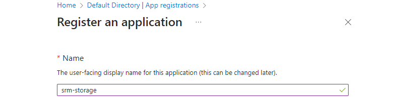

You can obtain your App Registration "application (client) ID" by clicking the "Overview" link for your registration.

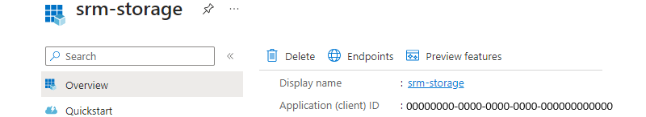

You can obtain your App Registration client secret value by clicking the "Certificates & secrets" link for your registration.


You must grant your app registration read/write access to your storage account containers along with access to read the delete blob policy you created. You can add a new role assignment by clicking the "Access Control (IAM)" link for your storage account.

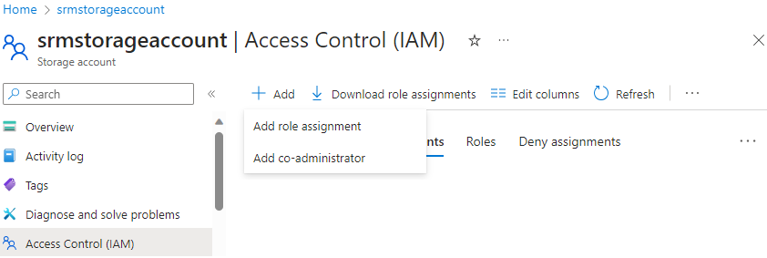

Your storage account role assignment should reference your app registration. As an example, you can grant read/write blob container policy with the Azure Storage Blob Data Contributor role and policy access with the Storage Account Contributor role.

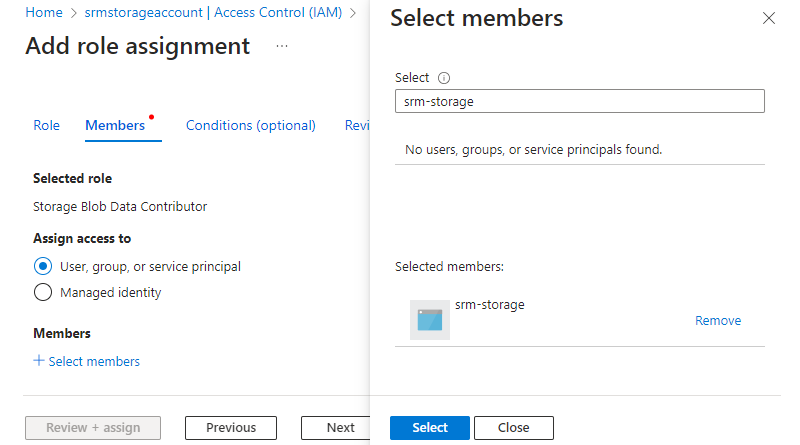

Ensure that the Cache Service and Storage Service have network connectivity to their blob containers.

## On-Cluster Scan Farm Pre-work

You can satisfy Scan Farm feature dependencies with components you install on your cluster. Note the license type for the components listed below. You are responsible for compliance with the licenses of third-party components.

### Scanner Nodes Pre-work

Scan Farm SAST or SCA analyses require a dedicated node pool with a specific node label and taint. You can run more than one SCA scan on a single node, but a single SAST analysis requires exclusive node access during the scan. You can assign a node label and taint using the following command where "scan-farm-worker-node-name" represents the name of a cluster node.

```
kubectl label --overwrite node scan-farm-worker-node-name pool-type=small
kubectl taint node scan-farm-worker-node-name NodeType=ScannerNode:NoSchedule
```

If using a cloud-hosted node pool, specify the node label and taint with your node pool configuration so that generated nodes meet Scan Farm requirements.

### Bitnami PostgreSQL Chart Pre-work

The PostgreSQL license is available [here](https://www.postgresql.org/about/licence/). The Bitnami PostgreSQL Helm chart license is available [here](https://github.com/bitnami/charts/tree/main/bitnami/postgresql#license).

Set the database name and the PostgreSQL password using the postgresql.auth.database and postgresql.auth.postgresPassword Helm chart parameters.

Allocate storage capacity and specify an instance size that meets the CPU and memory requirements in the Scan Farm Database Requirements section.

### Bitnami Redis Chart Pre-work

The Redis license is available [here](https://redis.io/docs/about/license/). The Bitnami Redis Helm chart license is available [here](https://github.com/bitnami/charts/tree/main/bitnami/redis#license).

Set the Redis architecture to standalone using the redis.architecture Helm chart parameter. You can enable authentication using the redis.auth.enabled chart parameter after setting the auth.existingSecret and auth.existingSecretPasswordKey parameters by referencing a Kubernetes Secret resource with the authentication password. The following is an example of the redis.commonConfiguration and redis.master chart parameters that customize Redis to meet Scan Farm requirements:

```
redis:
  architecture: standalone

  auth:
    enabled: true
    existingSecret: "redis-password"
    existingSecretPasswordKey: "password"

  commonConfiguration: |-
    save ""
    appendonly no
    maxmemory 1gb
    maxmemory-policy noeviction
  master:
    persistence:
      enabled: false
```

Set the redis.tls Helm chart configuration based on whether you plan to enable TLS for your Redis instance. You can find the Redis TLS certificate in its pod at /opt/bitnami/redis/certs/tls.crt.

### Bitnami MinIO Chart Pre-work

The MinIO software is licensed under the [GNU Affero General Public License v3.0](https://github.com/minio/minio/blob/master/LICENSE) or a commercial enterprise license. The Bitnami MinIO Helm chart license is available [here](https://github.com/bitnami/charts/tree/main/bitnami/minio#license).

Set MinIO's root username and password using the minio.auth.rootUser and minio.auth.rootPassword Helm chart parameters. You can define default buckets for the Storage Service and Cache Service using the minio.defaultBuckets chart parameter, or you can create them by hand after installing MinIO.  

You must configure a lifecycle policy on the cache bucket. You can use the following command with an "srm" mc alias you can define using the MinIO endpoint and root credential, replacing the cache-bucket name and day count (must be greater than, not equal to, 7) as necessary:

```
$ mc alias set srm <MinIO endpoint> <MinIO root username> <MinIO root password>
$ mc ilm add --expiry-days 30 srm/cache-bucket
```

If your Scan Farm storage runs on the same cluster where you plan to install Software Risk Manager, the Software Risk Manager web component can access your storage using the in-cluster storage URL. This optional optimization works only when both components run on the same cluster.

You can make MinIO available at a URL different from your Software Risk Manager URL. For example, if your Software Risk Manager hostname is srm.local, you can make MinIO available at a different URL like https://minio.local:9000/.

Alternatively, you can proxy MinIO by using the same hostname for both Software Risk Manager and MinIO. For example, if your Software Risk Manager hostname is srm.local, you can make MinIO available at https://srm.local/upload/.

The following example uses hostname `srm.local` to make the `minio` Kubernetes service available at http://srm.local/upload/. Note the use of the `use-regex` and `rewrite-target` annotations to drop "/upload/" when routing a request to the MinIO service.

```
apiVersion: networking.k8s.io/v1
kind: Ingress
metadata:
  annotations:
    nginx.ingress.kubernetes.io/proxy-body-size: 500m
    nginx.ingress.kubernetes.io/rewrite-target: /$1
    nginx.ingress.kubernetes.io/use-regex: "true"
  name: minio
  namespace: srm
spec:
  ingressClassName: nginx
  rules:
  - host: srm.local
    http:
      paths:
      - backend:
          service:
            name: minio
            port:
              number: 9000
        path: /upload/(.*)
        pathType: ImplementationSpecific
```

Note your external MinIO URL and your in-cluster URL if you plan to specify that optimization in the Helm Prep Wizard.

# Tool Orchestration Pre-work

You can skip this section if you do not plan to use the Tool Orchestration feature or if you plan to use the feature without external workflow storage. Complete the following pre-work before installing the Tool Orchestration feature with external workflow storage.

## Node Pool Pre-work

Tool Orchestration does not require a dedicated node pool, but you can establish one using Kubernetes labels and node taints. You can skip this section if you plan to run Tool Orchestration workloads alongside other Software Risk Manager workloads. The Software Risk Manager Helm chart includes a PodDisruptionBudget to help ensure that tool runs do not block higher-priority workloads.

## Object Storage Pre-work

When you opt for external workflow storage for Tool Orchestration workloads, you will not use the older MinIO version referenced by the Software Risk Manager Helm chart. You are responsible for configuring external object storage that supports the AWS S3 API and for creating a single bucket that you will use to store all Tool Orchestration workflow data.

### AWS

[Amazon S3](https://aws.amazon.com/s3/) is supported for tool orchestration workflow storage when your bucket is accessible using an access and secret key. The bucket must be accessible from the cluster running orchestrated analyses.

You can opt for this storage type by selecting `External (Access Key)` from the Orchestrated Analysis Storage screen of the Helm Prep Wizard.

>Note: Using [AWS IRSA](#aws-irsa) is preferred to using `External (Access Key)`.

The following AWS permissions are required for the AWS sevice account:

- s3:GetObject
- s3:DeleteObject
- s3:PutObject
- s3:ListBucket

You can follow the below example, which includes bash commands that shows one way to configure bucket access.

1. Define variables used for this example

```
account_id=$(aws sts get-caller-identity --query "Account" --output text)
username='username'
bucket='srm-bucket'
```

2. Create a policy

```
cat > srm-tool-orchestration-policy.json << EOF
{
    "Version": "2012-10-17",
    "Statement": [
        {
            "Sid": "VisualEditor0",
            "Effect": "Allow",
            "Action": [
                "s3:GetObject",
                "s3:DeleteObject",
                "s3:PutObject",
                "s3:ListBucket"
            ],
            "Resource": [
                "arn:aws:s3:::$bucket",
                "arn:aws:s3:::$bucket/*"
            ]
        }
    ]
}
EOF

aws iam create-policy --policy-name srm-tool-orchestration-policy --policy-document file://srm-tool-orchestration-policy.json
```

3. Attach policy to account

```
aws iam attach-user-policy --user-name=$username --policy-arn=arn:aws:iam::$account_id:policy/srm-tool-orchestration-policy
```

If you want to uninstall what you created above, run the following commands:

```
account_id=$(aws sts get-caller-identity --query "Account" --output text)
username='username'

policy_arn="arn:aws:iam::$account_id:policy/srm-tool-orchestration-policy"

aws iam detach-user-policy --user-name=$username --policy-arn=$policy_arn
aws iam delete-policy      --policy-arn $policy_arn
```

### AWS IRSA

[AWS IAM Roles for Service Account (IRSA)](https://docs.aws.amazon.com/eks/latest/userguide/iam-roles-for-service-accounts.html) is supported for tool orchestration workflow storage when your bucket is accessible from the AWS cluster running orchestrated analyses.

You can opt for this storage type by selecting `External (AWS IAM)` from the Orchestrated Analysis Storage screen of the Helm Prep Wizard.

You must provision Kubernetes ServiceAccount resources for both the SRM Tool Service and tool workflows and link them to the IAM permissions below. The Helm Prep Wizard will prompt for the account names.

The following AWS permissions are required for the tool service:

- s3:GetObject
- s3:DeleteObject
- s3:PutObject
- s3:ListBucket

The following AWS permissions are required for the workflow service:

- s3:GetObject
- s3:PutObject
- s3:ListBucket

After you have an [IAM OIDC provider for your cluster](https://docs.aws.amazon.com/eks/latest/userguide/enable-iam-roles-for-service-accounts.html), you can follow the below example, which includes bash commands that show one way to configure AWS IRSA for two service accounts named `toolsvc-sa` and `workflow-sa`.

1. Define variables used for this example

```
account_id=$(aws sts get-caller-identity --query "Account" --output text)
awsRegion='us-east-2'

clusterName='srm'
oidc_provider=$(aws eks describe-cluster --name $clusterName --region $awsRegion --query "cluster.identity.oidc.issuer" --output text | sed -e "s/^https:\/\///")

namespace='srm'
tool_svc_service_account='toolsvc-sa'
workflow_service_account='workflow-sa'

bucket='srm-bucket'
```

2. Create Tool Service policy

```
cat > tool-service-policy.json << EOF
{
    "Version": "2012-10-17",
    "Statement": [
        {
            "Sid": "VisualEditor0",
            "Effect": "Allow",
            "Action": [
                "s3:GetObject",
                "s3:DeleteObject",
                "s3:PutObject",
                "s3:ListBucket"
            ],
            "Resource": [
                "arn:aws:s3:::$bucket",
                "arn:aws:s3:::$bucket/*"
            ]
        }
    ]
}
EOF

aws iam create-policy --policy-name srm-tool-service-bucket-policy --policy-document file://tool-service-policy.json
```

3. Create Workflow policy

```
cat > workflow-policy.json << EOF
{
    "Version": "2012-10-17",
    "Statement": [
        {
            "Sid": "VisualEditor0",
            "Effect": "Allow",
            "Action": [
                "s3:PutObject",
                "s3:GetObject",
                "s3:ListBucket"
            ],
            "Resource": [
                "arn:aws:s3:::$bucket",
                "arn:aws:s3:::$bucket/*"
            ]
        }
    ]
}
EOF

aws iam create-policy --policy-name srm-workflow-bucket-policy --policy-document file://workflow-policy.json
```

4. Create Tool Service role

```
cat > tool-service-role.json << EOF
{
  "Version": "2012-10-17",
  "Statement": [
    {
      "Effect": "Allow",
      "Principal": {
        "Federated": "arn:aws:iam::$account_id:oidc-provider/$oidc_provider"
      },
      "Action": "sts:AssumeRoleWithWebIdentity",
      "Condition": {
        "StringEquals": {
          "$oidc_provider:aud": "sts.amazonaws.com",
          "$oidc_provider:sub": "system:serviceaccount:$namespace:$tool_svc_service_account"
        }
      }
    }
  ]
}
EOF

aws iam create-role --role-name srm-tool-service-bucket-role --assume-role-policy-document file://tool-service-role.json --description "srm-tool-service-bucket-role"
```

5. Create Workflow role

```
cat > workflow-role.json << EOF
{
  "Version": "2012-10-17",
  "Statement": [
    {
      "Effect": "Allow",
      "Principal": {
        "Federated": "arn:aws:iam::$account_id:oidc-provider/$oidc_provider"
      },
      "Action": "sts:AssumeRoleWithWebIdentity",
      "Condition": {
        "StringEquals": {
          "$oidc_provider:aud": "sts.amazonaws.com",
          "$oidc_provider:sub": "system:serviceaccount:$namespace:$workflow_service_account"
        }
      }
    }
  ]
}
EOF

aws iam create-role --role-name srm-workflow-bucket-role --assume-role-policy-document file://workflow-role.json --description "srm-workflow-bucket-role"
```

6. Attach policies to roles

```
aws iam attach-role-policy --role-name srm-tool-service-bucket-role --policy-arn=arn:aws:iam::$account_id:policy/srm-tool-service-bucket-policy

aws iam attach-role-policy --role-name srm-workflow-bucket-role --policy-arn=arn:aws:iam::$account_id:policy/srm-workflow-bucket-policy
```

7. Create Service Accounts

```
kubectl create namespace $namespace

kubectl -n $namespace create serviceaccount $tool_svc_service_account
kubectl -n $namespace create serviceaccount $workflow_service_account

kubectl -n $namespace annotate serviceaccount $tool_svc_service_account eks.amazonaws.com/role-arn=arn:aws:iam::$account_id:role/srm-tool-service-bucket-role
kubectl -n $namespace annotate serviceaccount $workflow_service_account eks.amazonaws.com/role-arn=arn:aws:iam::$account_id:role/srm-workflow-bucket-role
```

If you want to uninstall what you created above, run the following commands:

```
account_id=$(aws sts get-caller-identity --query "Account" --output text)

tool_service_policy_arn="arn:aws:iam::$account_id:policy/srm-tool-service-bucket-policy"
workflow_policy_arn="arn:aws:iam::$account_id:policy/srm-workflow-bucket-policy"

aws iam detach-role-policy --role-name=srm-tool-service-bucket-role --policy-arn=$tool_service_policy_arn
aws iam delete-role        --role-name=srm-tool-service-bucket-role
aws iam delete-policy      --policy-arn $tool_service_policy_arn

aws iam detach-role-policy --role-name=srm-workflow-bucket-role --policy-arn=$workflow_policy_arn
aws iam delete-role        --role-name=srm-workflow-bucket-role
aws iam delete-policy      --policy-arn $workflow_policy_arn

kubectl annotate serviceaccount -n $namespace $tool_svc_service_account eks.amazonaws.com/role-arn-
kubectl annotate serviceaccount -n $namespace $workflow_service_account eks.amazonaws.com/role-arn-

kubectl -n $namespace delete serviceaccount $tool_svc_service_account $workflow_service_account
```

### GCP

[Cloud Storage](https://cloud.google.com/storage/docs/introduction) is supported for tool orchestration workflow storage when your bucket is accessible using an [HMAC key](https://cloud.google.com/storage/docs/authentication/hmackeys) with an Access ID and Secret. The bucket must be accessible from the cluster running orchestrated analyses.

You can opt for this storage type by selecting `External (Access Key)` from the Orchestrated Analysis Storage screen of the Helm Prep Wizard.

### MinIO

[MinIO](https://min.io/) is supported for tool orchestration workflow storage when your bucket is accessible using an access and secret key. The bucket must be accessible from the cluster running orchestrated analyses.

You can opt for this storage type by selecting `External (Access Key)` from the Orchestrated Analysis Storage screen of the Helm Prep Wizard.

# Password Pre-work

How many passwords you must set will depend on how you deploy Software Risk Manager. The Helm chart will auto-generate unspecified passwords where support is available.

| Password/Key | Feature | Auto-generate Support |
|:-|:-:|:-:|
| Software Risk Manager Web Admin Password | Core | Y |
| Web Database User Password | Core | Y |
| | | |
| Web Database Root Password | Core (On-Cluster DB) | Y |
| Web Database Replication Password | Core (On-Cluster DB) | Y |
| | | |
| Private Docker Registry Password | Core (Private Registry) | Y |
| | | |
| SAML Java Keystore Password | Core (SAML Authentication) | Y |
| SAML Java Private Key Password | Core (SAML Authentication) | Y |
| | | |
| SIG Repo Password | Scan Farm | N |
| | | |
| Scan Farm PostgreSQL Password | Scan Farm | N |
| | | |
| Scan Farm Redis Auth Password | Scan Farm | N |
| | | |
| Scan Farm S3 Password | Scan Farm (AWS) | N |
| Scan Farm MinIO Root Password | Scan Farm (MinIO) | N |
| Scan Farm Azure Storage Access Key | Scan Farm (Azure) | N |
| Scan Farm Azure Storage Application Client Secret | Scan Farm (Azure) | N |
| | | |
| Tool Orchestration Tool Service Key | Tool Orchestration | Y |
| Tool Orchestration MinIO Admin Password | Tool Orchestration | Y |
| Tool Orchestration External Workflow Storage Password | Tool Orchestration | Y |

# Network Policies

The Software Risk Manager deployment supports network policies for non-Scan Farm components.

# TLS Connections

The Software Risk Manager deployment includes optional support for TLS connections between non-Scan Farm components by using Kubernetes Certificate Signing Requests (CSR).

## Cert-Manager

You can use the cert-manager support for Kubernetes CSRs, which is in an experimental state, to issue certificates for Software Risk Manager components. Follow the cert-manager kube-csr [installation instructions](https://cert-manager.io/docs/usage/kube-csr/) and then define either an Issuer or ClusterIssuer [resource](https://cert-manager.io/docs/configuration/).

Refer to the comments at the top of [values-tls.yaml](https://github.com/synopsys-sig/srm-k8s/blob/main/chart/values/values-tls.yaml) for how to create certificate resources.

# Licensing

You will receive a license zip file with four files if you purchased Software Risk Manager with the Scan Farm feature, including SAST and SCA.

| File | Purpose |
|:-|:-|
| 00000000-SRM-CDX.txt | Software Risk Manager Web license |
| 00000000-SRM-SAVE.dat | Software Risk Manager Scan Farm SAST license |
| 00000000-SRM-SCA.json | Software Risk Manager Scan Farm SCA license |
| 00000000-SRM-CodeSight.json | Software Risk Manager Code Sight license |

The Quick Start installation method described in the next section does not accept a license file, so you will enter your 00000000-SRM-CDX.txt file in the Software Risk Manager UI when prompted. The full installation process will prompt for a Web license file and the SAST and SCA licenses if you plan to use those Scan Farm features.

# Installation - Quick Start

You can follow the Quick Start instructions if you want to deploy Software Risk Manager using default settings and either the Core or Tool Orchestration features. If you want to customize your deployment or use the Scan Farm feature, you cannot use the Quick Start deployment method.

## Core Quick Start

Run the following commands to install Software Risk Manager Core using the default configuration:

```
$ helm -n srm upgrade --reset-values --install --create-namespace --repo https://synopsys-sig.github.io/srm-k8s srm srm # --set openshift.createSCC=true
```

>Note: If you are using OpenShift, remove `#` when running the last command.

## Tool Orchestration Quick Start

Run the following commands to install Software Risk Manager with Tool Orchestration using the default configuration:

```
$ git clone https://github.com/synopsys-sig/srm-k8s
$ kubectl apply -f srm-k8s/crds/v1
$ helm -n srm upgrade --reset-values --install --create-namespace --repo https://synopsys-sig.github.io/srm-k8s -f srm-k8s/chart/values/values-to.yaml srm srm # --set openshift.createSCC=true
```

>Note: If you are using OpenShift, remove `#` when running the last command.

## Fetch Initial Admin Password

You can retrieve the initial Software Risk Manager admin password using a command in the helm release notes, which appear when a helm install/upgrade concludes. You can view the helm release notes at any time by running this command, replacing the namespace and helm release name as necessary:

```
helm -n srm get notes srm
```

# Installation - Full

The full installation method supports all Software Risk Manager features and customizations. This GitHub repository contains tools to help simplify deploying Software Risk Manager on your cluster.

Your first Software Risk Manager Kubernetes deployment is a four-step process:

- Clone this GitHub Repository
- Run Helm Prep Wizard (once)
- Run Helm Prep Script
- Invoke helm/kubectl Commands

>Note: Software Risk Manager upgrades require three steps; you will not re-run the Help Prep Wizard when upgrading Software Risk Manager.

## Prerequisites

The deployment scripts in the [srm-k8s GitHub repository](https://github.com/synopsys-sig/srm-k8s) require [PowerShell Core](https://learn.microsoft.com/en-us/powershell/scripting/overview), which runs on macOS, Linux, and Windows. Additionally, the scripts in the repository depend on a [Java JRE](https://adoptium.net/temurin/releases/?version=11), specifically, the keytool program, which should be in your PATH.

- [PowerShell Core](https://learn.microsoft.com/en-us/powershell/scripting/overview) (not [Windows PowerShell](https://learn.microsoft.com/en-us/powershell/scripting/whats-new/differences-from-windows-powershell))
- [Java JRE](https://adoptium.net/temurin/releases/?version=11) (specifically, keytool in your PATH)
- [kubectl](https://kubernetes.io/docs/tasks/tools/install-kubectl) (version should match your cluster's Kubernetes version)

>Note: You do not need to be connected to your cluster to run the Helm Prep Wizard or Helm Prep Script because both use client-side kubectl capabilities.

### Windows Prerequisites

Ensure you can run PowerShell Core scripts on Windows by switching your PowerShell Execution Policy to RemoteSigned (recommended) or Unrestricted. You must run the Set-ExecutionPolicy -ExecutionPolicy RemoteSigned command from an elevated/administrator Command Prompt.

### PowerShell Module

The Helm Prep Wizard has a dependency on a Synopsys PowerShell module published to the [PowerShell Gallery](https://www.powershellgallery.com/packages/guided-setup) and [NuGet Repository](https://www.nuget.org/packages/guided-setup). The wizard will automatically download and install the module when it starts. If you would prefer to download and install the module by hand, refer to the [manual installation note](https://github.com/synopsys-sig/srm-k8s/blob/main/.install-guided-setup-module.ps1#L12) in the module installation script.

## Clone GitHub Repository

The [srm-k8s GitHub repository](https://github.com/synopsys-sig/srm-k8s) repository contains what you need to start your Software Risk Manager Kubernetes deployment. Clone the repository to a stable directory on your system. You will use your cloned repository for both your initial deployment and for deploying future Software Risk Manager software upgrades.

```
$ git clone https://github.com/synopsys-sig/srm-k8s
```

## Helm Prep Wizard

You can think of the Helm Prep Wizard as an interactive installation document that gets you ready to deploy Software Risk Manager using Helm. It is a [PowerShell Core 7](https://docs.microsoft.com/en-us/powershell/scripting/install/installing-powershell?view=powershell-7) script you can run on macOS, Linux, or Windows to select Software Risk Manager deployment features and gather required deployment parameters. The Helm Prep Wizard depends on the "guided-setup" PowerShell module, which gets downloaded automatically from the PowerShell Gallery. Alternatively, you can download the module from NuGet. If you prefer to download/install manually, refer to the instructions in the installation script.

The Helm Prep Wizard displays a series of questions to help you select Software Risk Manager features and specify related deployment parameters. If you need to return to a previous screen to correct an error or revisit a question, enter 'B' to choose the "Back to Previous Step" option. If you are responding to a prompt that is not multiple choice, press Enter to reveal the "Back to Previous Step" choice.

You typically run the Helm Prep Wizard once at the outset of your initial deployment. Start the wizard after [cloning](#clone-github-repository) this GitHub repository by running the helm-prep-wizard.ps1 script from the srm-k8s directory.

```
$ cd /path/to/srm-k8s
$ pwsh ./helm-prep-wizard.ps1
```

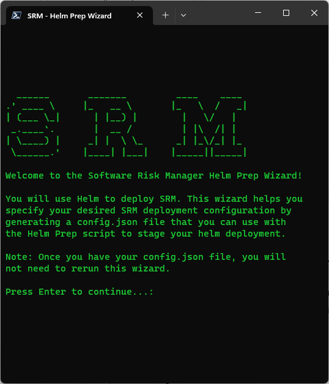

## Helm Prep Script

The Helm Prep Wizard concludes by creating a run-helm-prep.ps1 script that calls the Software Risk Manager Helm Prep Script with your deployment parameters to generate Helm command and values files with dependent Kubernetes YAML resource files suitable for your Software Risk Manager deployment.

Your deployment parameters end up in a file named config.json stored in the working directory you specified in the wizard.

### Configuration File Protection

The wizard prompts for a password when necessary to encrypt specific config.json files such as passwords and keys.

If you ever want to edit protected fields in config.json, first run the unlock-config.ps1 script to replace specific config.json encrypted field values with unencrypted values, leaving your config.json file unlocked.

```
$ pwsh /path/to/git/admin/config/unlock-config.ps1 -configPath /path/to/config.json
Enter config file password:
```

Run the lock-config.ps1 script to re-encrypt config.json field values, locking your config.json file.

```
$ pwsh /path/to/git/admin/config/lock-config.ps1 -configPath /path/to/config.json
Enter config file password:
```

### Invoking the Helm Prep Script

The Software Risk Manager Helm Prep Script outputs the kubectl/helm commands and installation notes to invoke your initial deployment. The contents of the run-helm-prep.ps1 script reference the Helm Prep Script and your config.json file.

The Helm Prep Script will prompt for the password you entered because it must unlock config.json before processing its contents. You can skip the prompt by either using script's -configFilePwd parameter or by setting the HELM_PREP_CONFIGFILEPWD environment variable.

```
$ cd /path/to/srm-k8s-work-dir # selected during Helm Prep Wizard
$ pwsh ./run-helm-prep.ps1
```

## Invoke helm/kubectl Commands

Your deployment occurs when you run the commands the Helm Prep Script generates. The output of the Helm Prep Script will look similar to the following. 

```
----------------------
K8s Installation Notes
----------------------
- Your deployment includes the scan farm feature. Remember to complete the following tasks:
  * Configure external dependencies (PostgreSQL, Redis, Object Storage)
  * Define your "small" scan job node pool:
  *   Assign a pool-type label (pool-type=small) to analysis node(s).
  *   Assign a scanner node taint (NodeType=ScannerNode:NoSchedule) to analysis node(s).
  *   NOTE: A "small" pool-type requires one or more nodes with 6.5 vCPUs and 26 GB of memory
- Follow instructions at https://github.com/synopsys-sig/srm-k8s/blob/main/docs/deploy/registry.md to pull/push Synopsys Docker images to your private registry.


----------------------
Required K8s Namespace
----------------------
kubectl create namespace srm

----------------------
Required K8s Resources
----------------------
kubectl apply -f "/path/to/.k8s-srm/chart-resources"

----------------------
Required Helm Commands
----------------------
helm repo add codedx https://codedx.github.io/codedx-kubernetes
helm repo add cnc https://sig-repo.synopsys.com/artifactory/sig-cloudnative
helm repo update
helm dependency update /path/to/git/srm-k8s/chart
helm -n srm upgrade --reset-values --install srm -f "/path/to/.k8s-srm/chart-values-combined/values-combined.yaml" --timeout 30m0s /path/to/git/srm-k8s/chart
```

- The optional `K8s Installation Notes` section will include steps you should take before creating K8s resources and running helm.
- The `Required K8s Namespace` contains the kubectl command to create your SRM namespace. If the namespace already exists, you can ignore that section.
- Running the kubectl command in the `Required K8s Resources` section will generate any K8s resources upon which your helm chart configuration depends.
- The `Required Helm Commands` section includes the helm commands you must run to deploy (or upgrade) SRM.

See the next section if you want to deploy Software Risk Manager using GitOps, specifically the Flux software. Otherwise, run the commands generated by the Helm Prep Script to deploy Software Risk Manager in your desired configuration.

### Fetch Initial Admin Password

You can retrieve the initial Software Risk Manager admin password using a command in the helm release notes, which appear when a helm install/upgrade concludes. You can view the helm release notes at any time by running this command, replacing the namespace and helm release name as necessary:

```
helm -n srm get notes srm
```

# Deploying with GitOps (Flux)

After running the Helm Prep Wizard and Helm Prep scripts, you can optionally deploy Software Risk Manager using Flux, which is one way to implement GitOps. The Software Risk Manager deployment includes support for generating Flux-related resources. You can use an alternative GitOps solution, like [Argo CD](https://argo-cd.readthedocs.io/en/stable/), by hand-creating the related GitOps resources.

This section describes how to configure a fictitious GitHub repository named "srm-gitops" for use with [Flux](https://fluxcd.io/flux/) and [Bitnami's Sealed Secrets](https://github.com/bitnami-labs/sealed-secrets). The configuration in the git repository will manage a Kubernetes cluster referred to as the "demo" cluster where a Software Risk Manager deployment can be managed using GitOps.

Instructions that follow refer to a fictitious GitHub repository at https://github.com/synopsys-sig/srm-gitops and a made-up "srm" kubectl context. To follow along with the instructions, replace the following content:

- replace the demo directory references with a directory name that represents your cluster
- replace the srm-gitops GitHub repository references with the location of your GitHub repository
- replace the srm kubectl context references with the context name associated with your cluster

## One-Time Setup Steps

For the most up-to-date instructions, refer to the [Flux bootstrap instructions](https://fluxcd.io/flux/installation/bootstrap/). Here are the one-time Flux v2.1 steps that will bootstrap the GitHub demo cluster:

### Flux Steps:

1) Switch to the srm context:

    ```
    kubectl config use-context srm
    ```

2) Provision a GitHub PAT for a user with all GitHub 'repo' permissions. Establish a GITHUB_TOKEN environment variable:

    ```
    export GITHUB_TOKEN=<PAT>
    ```

3) Download the flux CLI tool (v2.1) and verify prerequisites:

    ```
    flux check --pre
    ```

4) Download the repo:

    ```
    git clone https://github.com/synopsys-sig/srm-gitops
    ```

5) Bootstrap flux components on cluster (--token-auth bootstraps Flux for HTTPS repo access):

    ```
    cd ~/git/srm-gitops
    flux bootstrap github --token-auth --owner=sysnopsys-sig --repository=srm-gitops --branch=main --path=./demo
    ```

6) Pull latest for srm-deployment:

    ```
    cd ~/git/srm-gitops
    git pull --rebase
    ```

### Bitnami Sealed Secrets Steps:

1) Create directories for the sealed-secrets release:

    ```
    cd ~/git/srm-gitops
    mkdir -p ./demo/Releases/SealedSecrets/HelmRepository
    mkdir -p ./demo/Releases/SealedSecrets/HelmRelease
    ```

2) Generate the sealed-secrets HelmRepository resource file:

    ```
    cd ~/git/srm-gitops
    flux create source helm sealed-secrets --interval=1h --url=https://bitnami-labs.github.io/sealed-secrets --export > ./demo/Releases/SealedSecrets/HelmRepository/repo.yaml
    ```

3) Generate the sealed-secrets HelmRelease resource:

    ```
    cd ~/git/srm-gitops
    flux create helmrelease sealed-secrets --interval=1h --release-name=sealed-secrets-controller --target-namespace=flux-system --source=HelmRepository/sealed-secrets --chart=sealed-secrets --chart-version=">=1.15.0-0" --crds=CreateReplace --export > ./demo/Releases/SealedSecrets/HelmRelease/release.yaml
    ```

4) Commit files to deploy SealedSecrets:

    ```
    cd ~/git/srm-gitops
    git add ./demo/Releases/SealedSecrets
    git commit
    git push
    ```

5) Download Bitnami's [kubeseal](https://github.com/bitnami-labs/sealed-secrets/releases) and fetch public key:

    ```
    cd ~/git/srm-gitops
    kubeseal --fetch-cert --controller-name=sealed-secrets-controller --controller-namespace=flux-system > ./demo/sealed-secrets.pem
    ```

6) Commit the public key:

    ```
    cd ~/git/srm-gitops
    git add ./demo/sealed-secrets.pem
    git commit
    git push
    ```

## Software Risk Manager Deployment

With Flux and Bitnami's SealedSecrets deployed, after running the Helm Prep Wizard and Helm Prep script, run the new-flux.ps1 script in the /path/to/git/srm-k8s/admin/gitops directory, specifying the following script parameters:

```
param (
	[string]   $workDir = "$HOME/.k8s-srm",
	[Parameter(Mandatory=$true)][string] $namespace,
	[Parameter(Mandatory=$true)][string] $releaseName,
	[string]   $helmChartRepoUrl = 'https://synopsys-sig.github.io/srm-k8s',
	[string[]] $extraValuesFiles = @(),
	[switch]   $useSealedSecrets,
	[string]   $sealedSecretsNamespace = 'flux-system',
	[string]   $sealedSecretsControllerName = 'sealed-secrets-controller',
	[string]   $sealedSecretsPublicKeyPath
)
```

Use the `-extraValuesFiles` script parameter to include any extra SRM values files you use. Specify `-useSealedSecrets` to use the installed Sealed Secrets software and reference your Sealed Secrets public key file with the `-sealedSecretsPublicKeyPath` parameter. If you decide not to use Sealed Secrets, use an alternative solution to avoid storing Kubernetes secret resources in your git repository.

The new-flux.ps1 script will generate a flux-v2 directory under your work directory (`-workDir` parameter). The contents of flux-v2 will typically look like this:

```
├───ConfigMap
├───CRD
├───HelmRelease
├───HelmRepository
├───Namespace
└───SealedSecret
```

The flux-v2 directory contains the Kubernetes resources you can commit to your git repository to deploy Software Risk Manager with Flux. You can commit namespace-scoped resources to a Releases/SRM folder and cluster-scoped resources, like CRDs, under the demo folder representing your cluster:

```
├───demo
│   └───CRD
│   └───Releases
│       ├───SRM
│       │   ├───ConfigMap
│       │   ├───HelmRelease
│       │   ├───HelmRepository
│       │   ├───Namespace
│       │   └───SealedSecret
│       └───SealedSecrets
│           ├───HelmRelease
│           └───HelmRepository
```

Consider adding your *locked* config.json file and any files it references to your GitOps repository. Making your config.json file available to others will let them re-generate your work directory files and re-run new-flux.ps1 if and when that's required.

Be sure to run kubeseal by hand before adding extra Kubernetes secret resources referenced indirectly by config.json. You should drop the ".yaml" file extension from extra Helm values files to prevent Flux from trying to generate a related Kubernetes resource.

You can replace absolute paths in config.json by using paths relative to config.json's directory or `~` to reference paths relative to a home directory. For example, you can switch your work directory config.json parameter from `/Users/me/.k8s-srm` to `~/.k8s-srm`.

Below is an example showing config.json and srm-extra-props, renamed from srm-extra-props.yaml, in a HelmPrep folder under Releases/SRM. Also included is an srm-proxy-private-props.yaml SealedSecret resource created using kubeseal from the srm-proxy-private-props Kubernetes secret resource referenced by srm-extra-props.yaml:

```
├───demo
│   └───CRD
│   └───Releases
│       ├───SRM
│       │   ├───ConfigMap
│       │   ├───HelmPrep
│       │   ├───HelmPrep
│       │   |   ├─── config.json
│       │   |   ├─── srm-extra-props
│       │   |   ├─── srm-proxy-private-props.yaml
│       │   ├───HelmRelease
│       │   ├───HelmRepository
│       │   ├───Namespace
│       │   └───SealedSecret
│       └───SealedSecrets
│           ├───HelmRelease
│           └───HelmRepository
```

# Customizing Software Risk Manager (props)

You can change Software Risk Manager's behavior by specifying Software Risk Manager configuration properties. There are two types of property values you may want to configure. Private property values are those with values that should be protected such as passwords, and they get stored in a Kubernetes Secret. Public property values are loaded from a Kubernetes ConfigMap.

The following sections describe how to set both public and private properties by configuring Software Risk Manager to use a proxy server. This example assumes that you have already run the Helm Prep Wizard.

## Proxy Server Example

The following steps will configure a [proxy server](https://sig-product-docs.synopsys.com/bundle/srm/page/install_guide/CodeDxConfiguration/proxy.html) for Software Risk Manager using both public and private property values.

### Public Property Values

The steps in this section show you how to configure public property values by specifying values for proxy.host and proxy.port.

1. Create a file named `srm-extra-props.yaml` and add the proxy.host, proxy.port, and proxy.nonProxyHosts property values as a new section with key srm-public-props (use spaces for the indents, tab characters will cause a failure at install-time):

```
web:
  props:
    extra:
    - key:  srm-public-props
      type: values
      values:
      - "proxy.host = squid-restricted-http-proxy.squid"
      - "proxy.port = 3128"
      - "proxy.nonProxyHosts = srm-to.srm.svc.cluster.local|srm-web|localhost|*.internal.codedx.com"
```

>Note: Add non-proxy hosts as needed, separating each one with a pipe character. Software Risk Manager deployments using Tool Orchestration must include the fully qualified name of the Software Risk Manager tool service (srm-to.srm.svc.cluster.local in the above example). Software Risk Manager deployments using the Triage Assistant must include the Software Risk Manager web service name (srm-web in the above example).

2. The proxy accepts requests at port 3128. If you configured network policy, you must update your egress TCP port list using the networkPolicy property shown here:

```
web:
  props:
    extra:
    - key:  srm-public-props
      type: values
      values:
      - "proxy.host = squid-restricted-http-proxy.squid"
      - "proxy.port = 3128"
      - "proxy.nonProxyHosts = srm-to.srm.svc.cluster.local|srm-web|localhost|*.internal.codedx.com"
networkPolicy:
  web:
    egress:
      extraPorts:
        tcp: [22, 53, 80, 389, 443, 636, 7990, 7999, 3128]
```

>Note: Your egress extraPorts list may differ depending on installed features, so append 3128 as appropriate.

### Private Property Values

The steps in this section show you how to configure private property values by specifying the proxy.username and proxy.password values.

1. Create a file named `srm-proxy-private-props` (no file extension) and add the proxy.username and proxy.password properties:

```
proxy.username = codedx
proxy.password = password
```

2. If necessary, pre-create the Kubernetes Software Risk Manager namespace you specified during the Helm Prep Wizard.

```
kubectl create ns srm
```

3. Generate a Kubernetes Secret named `srm-proxy-private-props` in the Software Risk Manager namespace. For example, if your Code Dx namespace is srm, run the following command from the directory containing srm-proxy-creds-props:

```
kubectl -n srm create secret generic srm-proxy-private-props --from-file=srm-proxy-private-props
```

4. Edit your `srm-extra-props.yaml` file you created in the previous section and add a reference to the srm-proxy-private-props Kubernetes Secret you just created by appending an entry named srm-proxy-private-props to the extra array (last three lines shown below under web.props.extra):

```
web:
  props:
    extra:
    - key:  srm-public-props
      type: values
      values:
      - "proxy.host = squid-restricted-http-proxy.squid"
      - "proxy.port = 3128"
      - "proxy.nonProxyHosts = srm-to.srm.svc.cluster.local|srm-web|localhost|*.internal.codedx.com"
    - key: srm-proxy-private-props
      type: secret
      name: srm-proxy-private-props
networkPolicy:
  web:
    egress:
      extraPorts:
        tcp: [22, 53, 80, 389, 443, 636, 7990, 7999, 3128]
```

### Rerun Helm

1. Your run-help-prep.ps1 script outputs the helm command you should run to deploy Software Risk Manager. You can include your srm-extra-props.yaml file by appending `-f /path/to/srm-extra-props.yaml` to the helm command generated by your run-help-prep.ps1 script:

```
helm -n srm upgrade --reset-values --install srm ... -f /path/to/srm-extra-props.yaml

```

## Specify Extra SAML Configuration

Selecting SAML authentication in the Helm Prep Wizard will generate a config.json file with the following fields configured (field values are for illustrative purposes):

```
  ...
  "useSaml": true,
  "useLdap": false,
  "samlHostBasePath": "http://localhost:9090/srm",
  "samlIdentityProviderMetadataPath": "/path/to/idp-metadata.xml",
  "samlAppName": "srm-app",
  "samlKeystorePwd": "password",
  "samlPrivateKeyPwd": "password",
  ...
```

Running helm-prep.ps1 with a config.json file like the above will generate an Software Risk Manager props file with the following SAML properties:

- auth.saml2.identityProviderMetadataPath
- auth.saml2.entityId
- auth.saml2.keystorePassword
- auth.saml2.privateKeyPassword
- auth.hostBasePath

If you want to configure additional SAML properties described in the Software Risk Manager Install Guide, add them to your srm-extra-props.yaml file. 

>Note: Refer to the "Customizing Software Risk Manager (props)" section if you are unfamiliar with an srm-extra-props.yaml file.

Here's an example srm-extra-props.yaml with two SAML-specific props:

```
web:
  props:
    extra:
    - type: values
      key: srm-public-props
      values:
      - "ui.auth.samlLabel = Keycloak"
      - "auth.autoExternalRedirect = false"
```

## Specify LDAP Configuration

1. Complete the Helm Prep Wizard to generate the config.json file suitable for your Software Risk Manager deployment and invoke the resulting run-helm-prep.ps1 script.

2. Create a file named srm-ldap-private-props and add your LDAP props values. For example, you can set the LDAP URL, systemUsername, systemPassword, and authenticationMechanism by adding these values to your srm-ldap-private-props file:

```
auth.ldap.url = ldap://10.0.1.27
auth.ldap.systemUsername = CN=Code Dx Service Account,CN=Managed Service Accounts,DC=dc,DC=codedx,DC=local
auth.ldap.systemPassword = ************
auth.ldap.authenticationMechanism = simple
```

3. If necessary, pre-create the Kubernetes Software Risk Manager namespace you specified during the Helm Prep Wizard.

```
kubectl create ns srm
```

4. Generate a Kubernetes secret named srm-ldap-private-props in your Software Risk Manager namespace. For example, if your namespace is srm, run the following command from the directory containing srm-ldap-private-props:

```
kubectl -n srm create secret generic srm-ldap-private-props --from-file=srm-ldap-private-props
```

5. Reference your srm-ldap-private-props Kubernetes secret by adding a new entry to your srm-extra-props.yaml file.

```
codedxProps:
  extra:
  - key: srm-ldap-private-props
    type: secret
    name: srm-ldap-private-props
```

>Note: Refer to the "Customizing Software Risk Manager (props)" section if you are unfamiliar with an srm-extra-props.yaml file.

## Tool Orchestration Add-in Tool Configuration

There are four types of ConfigMaps that can contain resource requirements:

- Global
- Global Tool
- Project
- Project Tool

Software Risk Manager deployment creates the Global Resource Requirement, providing default resource requirements for tools across every project. Global Tool requirements override Global requirements for specific tools. Project requirements override Global and Global Tool requirements by providing default resource requirements for tools associated with a given project. Project Tool requirements override other requirements by specifying values for a specific tool in a particular project.

The following is an example of how the scopes can overlap:

Global Resource Requirement:
- CPU Request = 1
- CPU Limit = 4
- Memory Request = 11G
- Memory Limit = 12G

Global Tool Resource Requirement:
- CPU Request = 3

Project Resource Requirement:
- Memory Request = 13G

Project Tool Resource Requirement:
- Memory Limit = 14G

Here are the effective resource requirements resulting from the above:

Effective Resource Requirement:
- CPU Request = 3
- CPU Limit = 4
- Memory Request = 13G
- Memory Limit = 14G

The naming convention determines the scope of a resource requirement ConfigMap:

- Global: cdx-toolsvc-resource-requirements
- Global Tool: cdx-toolsvc-ToolName-resource-requirements
- Project: cdx-toolsvc-project-ProjectID-resource-requirements
- Project Tool: cdx-toolsvc-project-ProjectID-ToolName-resource-requirements

ProjectID is the integer value representing the Software Risk Manager project identifier and ToolName is the tool name converted to an acceptable k8s resource name by the following rules:

  - Uppercase letters must be converted to lowercase.
  - Any character other than a lowercase letter, number, dash, or period must be converted to a dash.
  - An initial character that is neither a number nor a lowercase letter must be preceded by the letter "s."
  - A name whose length is greater than 253, must be truncated to 253 characters.

### Add-in Example 1 - Project Resource Requirement

To create a resource requirement for all tool runs of a Software Risk Manager project represented by ID 21, create a file named cdx-toolsvc-project-21-resource-requirements.yaml and enter the following data:

```
apiVersion: v1
kind: ConfigMap
metadata:
  name: cdx-toolsvc-project-21-resource-requirements
data:
  requests.cpu: "1"
  limits.cpu: "2"
  requests.memory: "1G"
  limits.memory: "2G"
```
>Note: You can find a project's ID at the end of its Findings page URL. For example, a project with the ID 21 will have a Findings page URL that ends with /srm/projects/21.

Run the following command to create the ConfigMap resource, replacing the namespace name as necessary:

```
kubectl -n cdx-svc create -f ./cdx-toolsvc-project-21-resource-requirements.yaml
```

### Add-in Example 2 - Global Tool Resource Requirement

To create a Global Tool resource requirement for ESLint, create a file named cdx-toolsvc-eslint-resource-requirements.yaml and enter the following data:

```
apiVersion: v1
kind: ConfigMap
metadata:
  name: cdx-toolsvc-eslint-resource-requirements
data:
  requests.cpu: "2"
  limits.cpu: "3"
  requests.memory: "4G"
  limits.memory: "5G"
```

Run the following command to create the configmap resource, replacing the namespace name as necessary:

```
kubectl -n cdx-svc create -f ./cdx-toolsvc-eslint-resource-requirements.yaml
```

### Add-in Example 3 - Node Selector

To create a Global Tool resource requirement for running a tool named MyTool on cluster nodes labeled with `canrunmytool=yes`, create a file named cdx-toolsvc-mytool-resource-requirements.yaml and enter the following data:

```
apiVersion: v1
kind: ConfigMap
metadata:
  name: cdx-toolsvc-mytool-resource-requirements
data:
  nodeSelectorKey: canrunmytool
  nodeSelectorValue: yes
```

Run the following command to create the configmap resource, replacing the namespace name as necessary:

```
kubectl -n cdx-svc create -f ./cdx-toolsvc-mytool-resource-requirements.yaml
```

# Maintenance

Refer to this section for details on operating your Software Risk Manager deployment.

## Software Risk Manager Admin Password Reset

Updating the administrator password for your Software Risk Manager deployment is a two-step process:

1. Change your admin password
2. Update the admin password in the related Kubernetes Secret resource (mandatory when using the Scan Farm feature)

You can change your admin password using the web application or the API. To update using the web application, log on using your admin credential, visit /srm/me, click Password, and update your password. Alternatively, set a new password using the API at /x/profile/password.

Failing to update your admin Kubernetes Secret resource when using the Scan Farm feature will block future Software Risk Manager upgrades. While you can temporarily update the resource by hand, the Helm Prep script will revert your update if you do not also update config.json, so consider updating config.json and regenerating your Kubernetes Secret resource(s) by re-running the script:

1. [Unlock config.json](#configuration-file-protection)
2. Edit config.json by updating the `adminPwd` parameter
3. [Lock config.json](#configuration-file-protection)
4. Rerun your run-helm-prep.ps1 script
5. Run the command(s) listed under Required K8s Resources

# Backup and Restore

Software Risk Manager depends on [Velero](https://velero.io) for cluster state and volume data backups. When not using an external web database, you must deploy with at least one MariaDB subordinate database so that a database backup occurs before Velero runs a backup.

If you are using an external web database, your database will not be included in the Velero-based backup. You must create a database backup schedule on your own. To minimize data loss, schedule your database backups to coincide with your cluster backups to help align your Kubernetes volume and database data after a restore.

> Note: The overall backup process is not an atomic operation, so it's possible to capture inconsistent state in a backup. For example, the web AppData volume backup could include a file that was unknown at the time the database backup occurred. The likelihood of capturing inconsistent state is a function of multiple factors including system activity and the duration of backup operations.

## About Velero

Velero can back up Kubernetes state stored in etcd and Kubernetes volume data. Volume data gets backed up using either [storage provider plugins](https://velero.io/docs/main/supported-providers/), or Velero's integration with [Restic](https://restic.net/) or [Kopia](https://kopia.io/). Refer to [How Velero Works](https://velero.io/docs/main/how-velero-works/), [How Velero integrates with Restic](https://velero.io/docs/main/file-system-backup/#how-velero-integrates-with-restic), and [How Velero integrates with Kopia](https://velero.io/docs/main/file-system-backup/#how-velero-integrates-with-kopia) for more details.

> Note: Use Velero's Restic or Kopia integration when a storage provider plugin is unavailable for your environment.

## Installing Velero

Install the [Velero CLI](https://velero.io/docs/main/basic-install/#install-the-cli) and then follow the Velero installation documentation for your scenario. You can find links to provider-specific documentation in the Setup Instructions column on the [Providers](https://velero.io/docs/main/supported-providers/) page, which includes links to the [Azure](https://github.com/vmware-tanzu/velero-plugin-for-microsoft-azure#setup) and [AWS](https://github.com/vmware-tanzu/velero-plugin-for-aws#setup) instructions. If you're not using a storage provider plugin, [enable file system backup](https://velero.io/docs/main/customize-installation/#enable-file-system-backup) at install time.

> Note: If your Velero backup unexpectedly fails, you may need to increase the amount of memory available to the Velero pod. Use the --velero-pod-mem-limit parameter with the velero install command as described [here](https://velero.io/docs/main/customize-installation/#customize-resource-requests-and-limits).

## Create a Backup Schedule

After installing Velero, you can create a [Schedule resource](https://velero.io/docs/main/api-types/schedule/).

### Schedule for On-Cluster Database

If you are using an on-cluster Software Risk Manager database, create a Schedule resource using the following YAML, replacing namespace names `velero` and `srm` as necessary.

```
apiVersion: velero.io/v1
kind: Schedule
metadata:
  name: srm-schedule
  namespace: velero
spec:
  schedule: 0 3 * * *
  template:
    hooks:
      resources:
      - includedNamespaces:
        - srm
        labelSelector:
          matchLabels:
            app: mariadb
            component: slave
        name: database-backup
        pre:
        - exec:
            command:
            - /bin/bash
            - -c
            - /bitnami/mariadb/scripts/backup.sh && sleep 1m
            container: mariadb
            timeout: 30m
    includeClusterResources: true
    includedNamespaces:
    - srm
    storageLocation: default
    ttl: 720h0m0s
```

>Note: The above Schedule requires a replica Software Risk Manager database whose backup.sh script will be invoked as a pre-backup hook.

### Schedule for External Database

If you are using an external Software Risk Manager database, create a Schedule resource using the following YAML, replacing namespace names `velero` and `srm` as necessary. Ensure that the external database backup occurs at the same time indicated by `spec.schedule`.

```
apiVersion: velero.io/v1
kind: Schedule
metadata:
  name: srm-schedule
  namespace: velero
spec:
  schedule: 0 3 * * *
  template:
    includeClusterResources: true
    includedNamespaces:
    - srm
    storageLocation: default
    ttl: 720h0m0s
```

## Verify Backup

Once backups start running, use the velero commands that [describe backups and fetch logs](https://velero.io/docs/v1.5/troubleshooting/#general-troubleshooting-information) to confirm that the backups are completing successfully and that they include Software Risk Manager volumes.

When using Velero with Storage Provider Plugins, the volume snapshots initiated by a plugin may finish after the Backup resource reports a completed status. Wait for the volume snapshot process to finish before starting a restore.

If applicable, you should also confirm that the database backup script runs correctly and produces database backups with each Velero backup in the /bitnami/mariadb/backup/data directory. Use the following command after replacing placeholder parameters to list recent backups for a MariaDB subordinate database instance:

```
$ kubectl -n srm-namespace-placeholder exec srm-mariadb-slave-pod-placeholder -- ls /bitnami/mariadb/backup/data
```

> Note: Older backup files get removed from the database volume when backups complete.

You can use this command to view the backup log on a MariaDB slave database instance.

```
$ kubectl -n srm-namespace-placeholder exec srm-mariadb-slave-pod-placeholder -- cat /bitnami/mariadb/backup/data/backup.log
```

The backup.log file should have a "completed OK!" message above the log entries indicating that old backups are getting removed.

> Note: To confirm that a backup includes the volume holding your Software Risk Manager database backup, test a backup by running a restore.

You should periodically check your Velero backups based on your backup schedule to ensure that backups are succeeding.

## Restoring Code Dx

Velero will skip restoring resources that already exist, so delete those you want to restore from a backup. You can delete the Software Risk Manager namespace to remove all namespaced resources, and you can delete cluster scoped Software Risk Manager resources to remove Software Risk Manager entirely. Since Software Risk Manager depends on multiple PersistentVolume (PV) resources, you will typically want to delete Software Risk Manager PVs when restoring Software Risk Manager to a previous known good state.

There are two steps required to restore Software Risk Manager from a Velero backup. The first step is to use the velero CLI to restore a specific backup. For the second step, you will run the restore-db.ps1 script to restore a local Software Risk Manager database. If you're using an external database, you will skip the second step by restoring your Software Risk Manager database on your own.

>Note: When using Velero with Storage Provider Plugins, wait for the volume snapshot process to finish before restoring a backup.

### Step 1: Restore Cluster State and Volume Data

During Step 1, you will use Velero to restore cluster and volume state from an existing backup. You can see a list of available backups by running the following command:

```
$ velero get backup
```

Assuming you want to restore a backup named 'my-backup', run the following command to install the PriorityClass resources from that backup:

```
$ velero restore create --from-backup my-backup --include-resources=PriorityClass
```

Wait for the restore started by the previous command to finish. You can use the describe command it prints to check progress.

A restore may finish with warnings and errors indicating that one or more resources could not be restored. Velero will not delete resources during a restore, so you may see warnings about Velero failing to create resources that already exist. Review any warnings and errors displayed by Velero's describe and log commands to determine whether they can be ignored.

> Note: You can use Velero's log command to view the details of a restore after it completes.

After waiting for the restore operation to finish, run the following command to restore the remaining resources from your backup:

```
$ velero restore create --from-backup my-backup
```

> Note: Running two velero commands works around an issue discovered in Velero v1.3.2 that blocks the restoration of Software Risk Manager pods. If you run only the second command, Software Risk Manager priority classes get restored, but pods depending on those classes do not.

When using Velero with storage provider plugins, your Software Risk Manager and MariaDB pods may not return to a running state. Step 2 will resolve that issue.

> Note: Software Risk Manager is not ready for use at the end of Step 1.

### Step 2: Restore Software Risk Manager Database

During Step 2, you will run the admin/restore-db.ps1 script to restore the Software Risk Manager database from a backup residing on the volume data you restored. If you are using an external Software Risk Manager database, restore your external database to a time that coincides with your Software Risk Manager backup and skip this section.

At this point, you can find the database backup corresponding to the backup you want to restore. Refer to the Verify Backup section for the command to list backup files on a MariaDB slave database instance. Note the name of the database backup that coincides with the Velero backup you restored (e.g., '20200523-020200-Full'). You will enter this name when prompted by the restore-db.ps1 script.

You must add both the helm and kubectl programs to your path before running the restore database script. Start a new PowerShell Core 7 session and change directory to where you downloaded the setup scripts from the [srm-k8s](https://github.com/synopsys-sig/srm-k8s).

```
/$ pwsh
PS /> cd ~/git/srm-k8s/admin
```

Start the restore-db.ps1 script by running the following command after replacing parameter placeholders:

```
PS /git/srm-k8s/admin> ./restore-db.ps1 `
        -namespaceCodeDx 'srm-namespace-placeholder' `
        -releaseNameCodeDx 'srm-helm-release-name-placeholder'
```

> Note: You can pull the Software Risk Manager Restore Database Docker image from an alternate Docker registry using the -imageDatabaseRestore parameter and from a private Docker registry by adding the -dockerImagePullSecretName parameter.

When prompted by the script, enter the name of the database backup you want to restore and the passwords for the MariaDB database root and replicator users. The script will search for the database backup, copy it to a folder in your profile, and use the backup to restore both master and slave database(s). It will then restart database replication, and it will manage the running instances of MariaDB and Software Risk Manager, so when the script is finished, all Software Risk Manager pods will be online. Depending on your ingress type and what was restored, you may need to update your DNS configuration before using the new Software Risk Manager instance.

> Note: The restore-db.ps1 script requires that your work directory (default is your profile directory) not already include a folder named backup-files. The script will stop if it finds that directory, so delete it before starting the script.

## Removing Backup Configuration

If you need to uninstall the backup configuration and Velero, do the following:

- Remove the Velero Schedule resource for your Software Risk Manager instance and related Backup and Restore resources (you can remove *all* Velero backup and restore objects by running `velero backup delete --all` and `velero restore delete --all`)
- [Uninstall Velero](https://velero.io/docs/main/uninstalling/)

## Reset Database Replication

Velero backups configured with an on-cluster MariaDB Web database depend on properly functioning replication. You can run the following command on a MariaDB replica database to see the replication status:

```
$ mysql -uroot -p
Enter password:
MariaDB [(none)]> SHOW REPLICA STATUS \G;
```

If the replication state shows an error permanently blocking data from moving between the primary and replica instances, replication should be reset to ensure proper backups. You can reset replication with the following steps that use four different terminal windows.

>Note: The steps assume two statefulsets named srm-mariadb-master and srm-mariadb-slave and a deployment named srm-web in the srm namespace with one subordinate database. It also assumes a database named codedx.

Terminal 1 (Subordinate DB):

1.	kubectl -n srm scale --replicas=0 deployment/srm-web
2.	kubectl -n srm exec -it srm-mariadb-slave-0 -- bash
3.	mysql -uroot -p
4.	STOP SLAVE;
5.	exit # mysql

Terminal 2 (Master DB):

6.	kubectl -n srm exec -it srm-mariadb-master-0 -- bash
7.	mysql -uroot -p
8.	RESET MASTER;
>Note: RESET MASTER deletes previous binary log files, creating a new binary log file.
9.	FLUSH TABLES WITH READ LOCK;

Terminal 3 (Master DB):

10.	kubectl -n srm exec -it srm-mariadb-master-0 -- bash
11.	mysqldump -u root -p codedx > /bitnami/mariadb/srm-dump.sql

>Note: The above command assumes you have adequate space at /bitnami/mariadb to store your database backup. Use an alternate path as necessary, and adjust paths in subsequent steps accordingly.

Terminal 2 (Master DB)

12.	UNLOCK TABLES;

Terminal 4:

13.	kubectl -n srm cp srm-mariadb-master-0:/bitnami/mariadb/srm-dump.sql ./srm-dump.sql
14.	kubectl -n srm cp ./srm-dump.sql srm-mariadb-slave-0:/bitnami/mariadb/srm-dump.sql

Terminal 1 (Subordinate DB):

15.	mysql -u root -p codedx < /bitnami/mariadb/srm-dump.sql
16.	mysql -uroot -p
17.	RESET SLAVE;
>Note: RESET SLAVE deletes relay log files.
18. Remove old binary log files by running "SHOW BINARY LOGS;" and "PURGE BINARY LOGS TO 'name';"
>Note: If you previously deleted binary log files (mysql-bin.000*) from the file system, remove the contents of the mysql-bin.index text file.
19.	CHANGE MASTER TO MASTER_LOG_FILE='mysql-bin.000001', MASTER_LOG_POS=1;
20.	START SLAVE;
21.	SHOW SLAVE STATUS \G;
22.	exit # mysql
23.	rm /bitnami/mariadb/srm-dump.sql
24.	exit # pod
25.	exit # terminal

Terminal 2 (Master DB):

26.	exit # mysql
27.	rm /bitnami/mariadb/srm-dump.sql
28.	exit # pod
29.	exit # terminal

Terminal 3 (Master DB):

30.	exit # pod
31.	exit # terminal

Terminal 4:

32.	kubectl -n srm scale --replicas=1 deployment/srm-web
33.	exit # terminal

# Upgrades

Software Risk Manager has four major releases typically spaced evenly throughout the year. Minor releases are published on the second Tuesday of each month, with hotfixes released as needed. Updates get advertised with a notification in the Software Risk Manager web interface.

You will not rerun the Helm Prep Wizard to upgrade Software Risk Manager. An upgrade occurs with a three-step process:

- Pull latest from this GitHub Repository
- Re-run Helm Prep Script
- Re-invoke helm/kubectl Commands

The [srm-k8s GitHub repository](https://github.com/synopsys-sig/srm-k8s) repository gets updated with each Software Risk Manager deployment. Future Software Risk Manager upgrades start by updating your clone of the repository by fetching the latest commits (git pull). If you open your run-helm-prep.ps1 script, you'll notice how it points to the Helm Prep Script in your repo clone, allowing you to run the Helm Prep Script associated with a specific Software Risk Manager version.

Re-running your run-helm-prep.ps1 script will generate the latest kubectl/helm commands for the Software Risk Manager version you're upgrading to. Invoking those commands will upgrade your Software Risk Manager software.

```
$ cd /path/to/srm-k8s
$ git pull
$ cd /path/to/srm-k8s-work-dir # selected during Helm Prep Wizard
$ pwsh ./run-helm-prep.ps1
$ optionally re-pull/push Software Risk Manager Docker images (see note)
$ run helm/kubectl commands
```

>Note: If you previously pulled Software Risk Manager Docker images from the Synopsys Docker registry, re-pull/push the Docker images for the upgraded Software Risk Manager version before running your helm command.

## TLS

The TLS configuration for the Scan Farm Cache Service and the optional inter-component TLS will get regenerated during a helm install or upgrade. It may be necessary to restart pods configured for TLS if they do not restart during a helm upgrade.

## Adding the Scan Farm Feature

You can add the Scan Farm feature to an existing Software Risk Manager deployment, provided that you are using the latest deployment model (srm-k8s, not codedx-kubernetes). You will update your config.json file by running the Add Scan Farm Wizard and then re-running the Helm Prep Script via your run-helm-prep.ps1 script.

You should complete all of the Scan Farm pre-work before running the add-scanfarm.ps1 script.

```
$ cd /path/to/srm-k8s
$ pwsh ps/features/add-scanfarm.ps1 -configPath /path/to/work/directory/config.json
```

# Code Dx Deployment Model Migration

Code Dx was renamed the Software Risk Manager with the 2023.8.0 release, which introduced a new deployment model that supports a separately licensed Scan Farm feature with built-in SAST and SCA scanning powered by Coverity and Black Duck.

The new deployment model differs from the legacy one in the following ways:

| Deployment Detail | Old Model | New Model |
|:-|:-:|:-:|
| Wizard | Guided Setup | Helm Prep Wizard |
| Script | Deployment Script | Helm Prep Script |
| Requires Connected Cluster | Yes | No |
||||
| Git Repo | [codedx-kubernetes](https://github.com/codedx/codedx-kubernetes) | [srm-k8s](https://github.com/synopsys-sig/srm-k8s) |
| Chart Repo | n/a | https://synopsys-sig.github.io/srm-k8s |
||||
| Helm Charts | 2 | 1 |
| Namespaces | 2 | 1 |
||||
| Core Feature | Yes | Yes |
| Tool Orchestration Feature | Yes | Yes |
| Scan Farm Feature | No | Yes |
||||
| Manual Helm Deployment | Yes | Yes |
| Automated Helm Deployment | Yes | No |
| Flux v1 GitOps Deployment | Yes | No |
| Flux v2 GitOps Deployment | Yes | Yes |
| YAML Deployment | Yes | No |
||||
| Pre-work Deployment Guide | No | Yes |
| Quick Start Deployments | 0 | 2 |
| Full Deployment Prereqs | 7 | 3 |
| Full Deployment Configuration | run-setup.ps1 parameters | config.json file (conditionally password-protected) |

The legacy deployment model available at [codedx-kubernetes](https://github.com/codedx/codedx-kubernetes) contains the Guided Setup that you previously ran to populate your initial run-setup.ps1 file with the Code Dx Deployment Script parameters suitable for your Code Dx installation. This section explains how to switch from the legacy deployment model to the new one, using your run-setup.ps1 as input into the migration process.

Installing Software Risk Manager from scratch without a data migration is a four-step process:

- Clone this GitHub Repository
- Run the Helm Prep Wizard (once)
- Run the Helm Prep Script
- Invoke helm/kubectl Commands

Migrating from your legacy Code Dx deployment to Software Risk Manager requires these steps:

- Clone this GitHub Repository
- Run the Software Risk Manager Migration Script
- Run the Helm Prep Script
- Invoke helm/kubectl Commands
- Copy Code Dx Data to Software Risk Manager

Note how the Software Risk Manager Migration Script replaces the Helm Prep Wizard and how the migration process has an extra step to copy data between your Code Dx and Software Risk Manager deployments.

In the new deployment model, the Helm Prep Wizard replaces the Code Dx Guided Setup. Whereas the Guided Setup stored Deployment Script parameters in a run-setup.ps1 file, the wizard generates a config.json file with your deployment parameters. The Helm Prep Script replaces the Code Dx Deployment script and takes as input the config.json file generated by the wizard.

You will not run the Helm Prep Wizard when migrating your Code Dx deployment because your Software Risk Manager configuration gets inferred from the content of your legacy deployment's run-setup.ps1 script.

## Before you Begin

Before you get started, make sure that you have satisified the Software Risk Manager deployment [prerequisites](#prerequisites) and understand the [requirements](#requirements).

Back up your Code Dx system now so that you can restore its state should something go wrong with your data migration.

>Note: Data migration for external workflow storage is unsupported because it will be reused with your Software Risk Manager deployment. Contact Synopsys if you would like guidance on how to avoid reuse for external workflow storage.

## Clone the srm-k8s GitHub Repository

The [srm-k8s GitHub repository](https://github.com/synopsys-sig/srm-k8s) includes the scripts you need to migrate from the Code Dx deployment model to the Software Risk Manager one. Run the following command to clone the repository by fetching the files required to install the latest Software Risk Manager release:

```
$ git clone https://github.com/synopsys-sig/srm-k8s
$ cd /path/to/git/srm-k8s
```

>Note: Make sure that the version of Software Risk Manager you are installing is equal to your Code Dx version. If you are running a Code Dx version that is less than 2023.8.0, you should upgrade your Code Dx version before continuing.

## Stop Code Dx Web

You must turn off the Code Dx Web workload, leaving it offline during the migration process.

1) Scale down your source Code Dx web workload, replacing the `cdx-app` namespace and `codedx` deployment name as necessary:

```
$ kubectl -n cdx-app scale --replicas=0 deployment/codedx
```

## Stop Code Dx Tool Orchestration (if installed)

You must turn off Code Dx Tool Orchestration workloads, leaving them offline during the migration process.

1) Scale down your source Code Dx Tool Orchestration workloads, replacing the `cdx-svc` namespace, `codedx-tool-orchestration` and `codedx-tool-orchestration-minio` deployment names as necessary:

```
$ kubectl -n cdx-svc scale --replicas=0 deployment/codedx-tool-orchestration
$ kubectl -n cdx-svc scale --replicas=0 deployment/codedx-tool-orchestration-minio
```

## Run the Software Risk Manager Migration Script

Your Code Dx to Software Risk Manager migration starts with the migrate.ps1 script whose command-line interface matches the Code Dx deployment script parameters you will find in your run-setup.ps1 file.

Locate your run-setup.ps1 file before continuing. The script should be runnable from its current location. For example, any files it references must be present on your local system.

Make a copy of your run-setup.ps1 file:

```
$ cp /path/to/run-setup.ps1 /path/to/run-migrate.ps1
```

Edit run-migrate.ps1 by replacing /path/to/git/codedx-kubernetes/setup/steps/../core/setup.ps1 with the path to the migrate.ps1 script. For example, your edited file will look like this:

```
/path/to/git/srm-k8s/admin/migrate/migrate.ps1 -workDir '/home/user/.k8s-codedx' -kubeContextName 'cluster' -kubeApiTargetPort '443' -namespaceCodeDx 'cdx-app' -releaseNameCodeDx 'codedx' ...
```

Invoke your run-migrate.ps1 script to generate a config.json file.

```
$ pwsh /path/to/run-migrate.ps1
```

>Note: You should specify a new, unique namespace and release name to avoid conflating legacy Code Dx Kubernetes resources with Software Risk Manager ones. You can reuse your Code Dx license when prompted for an Software Risk Manager Web license.

Address any warnings or instructions printed by the migration script. When complete, invoke the generated run-helm-prep.ps1 file to stage the resources required for your Software Risk Manager deployment.

## Install Software Risk Manager

Invoke the run-helm-prep.ps1 script generated by your run-migrate.ps1 script, which you will find in the new work directory you specified. 

```
$ pwsh /path/to/run-helm-prep.ps1
```

Follow the instructions printed by run-helm-prep.ps1 and wait for Software Risk Manager to come online before continuing to the next section to import your Code Dx data into Software Risk Manager.

>Note: If you are using an external database, you will upgrade that database at deployment-time.

## Stop Software Risk Manager Web

Wait for all Software Risk Manager pods to reach a ready state before stopping Software Risk Manager workloads. You must turn off the Software Risk Manager Web workload, leaving it offline during the migration process.

1) Scale down your destination Software Risk Manager Web workload, replacing the `srm` namespace and `srm-web` deployment name as necessary:

```
$ kubectl -n srm scale --replicas=0 deployment/srm-web
```

## Stop Software Risk Manager Tool Orchestration (if installed)

1) Scale down your destination Software Risk Manager Tool Orchestration instance, replacing the `srm` namespace, `srm-to` and `srm-minio` deployment names as necessary:

```
$ kubectl -n srm scale --replicas=0 deployment/srm-to
$ kubectl -n srm scale --replicas=0 deployment/srm-minio
```

## Work Directory

You will be copying files between remote pods and your local system, so start by switching to a local directory with sufficient disk space. We'll refer to this directory as your work directory.

```
$ cd /path/to/local/work/directory
```

## Copy Code Dx Web Files Locally

You must copy data from your Code Dx Web volume(s) to your Software Risk Manager Web volume. 

1) Save the following content to a file named host-code-dx-appdata-volume.yaml in /path/to/local/work/directory, replacing the `cdx-app` namespace, `codedx/codedx-tomcat:v2023.8.0` Docker image name (with the version you are running), and `codedx-appdata` volume name as necessary:

>Note: You can find your Code Dx AppData volume name with this command, replacing the `cdx-app` namespace as necessary: kubectl -n cdx-app get pvc

```
apiVersion: v1
kind: Pod
metadata:
  name: host-code-dx-appdata-volume
  namespace: cdx-app
spec:
  containers:
    - image: codedx/codedx-tomcat:v2023.8.0
      name: host-code-dx-appdata-volume
      command: ["sleep", "1d"]
      volumeMounts:
      - mountPath: "/var/cdx"
        name: volume
  securityContext:
    fsGroup: 1000
    runAsGroup: 1000
    runAsUser: 1000
  volumes:
    - name: volume
      persistentVolumeClaim:
        claimName: codedx-appdata
```

2) Run the following command to start the host-code-dx-appdata-volume pod, replacing the `cdx-app` namespace as necessary:

```
$ cd /path/to/local/work/directory
$ kubectl apply -f host-code-dx-appdata-volume.yaml
$ kubectl -n cdx-app wait --for=condition=Ready pod/host-code-dx-appdata-volume
```

3) Run the following commands to copy your Code Dx files locally, replacing the `cdx-app` namespace as necessary:

```
$ cd /path/to/local/work/directory
$ kubectl -n cdx-app exec -it host-code-dx-appdata-volume -- bash
$ cd /var/cdx
$ tar -cvzf /var/cdx/appdata.tgz $(ls -d analysis-files keystore/master.key keystore/Secret tool-data/addin-tool-files 2> /dev/null)
$ exit
$ kubectl -n cdx-app cp host-code-dx-appdata-volume:/var/cdx/appdata.tgz appdata.tgz
```

4) Run the following command to delete the host-code-dx-appdata-volume pod:

```
$ kubectl delete -f /path/to/local/work/directory/host-code-dx-appdata-volume.yaml
```

5) Delete the /path/to/local/work/directory/host-code-dx-appdata-volume.yaml file.

## Copy Local Code Dx Web Files to Software Risk Manager

1) Save the following content to a file named host-srm-appdata-volume.yaml in /path/to/local/work/directory, replacing the `srm` namespace, `codedx/codedx-tomcat:v2023.8.0` Docker image name (with the version you are running), and `srm-appdata` volume name as necessary:

>Note: You can find your Software Risk Manager AppData volume name with this command, replacing the `srm` namespace as necessary: kubectl -n srm get pvc

```
apiVersion: v1
kind: Pod
metadata:
  name: host-srm-appdata-volume
  namespace: srm
spec:
  containers:
    - image: codedx/codedx-tomcat:v2023.8.0
      name: host-srm-appdata-volume
      command: ["sleep", "1d"]
      volumeMounts:
      - mountPath: "/var/srm"
        name: volume
  securityContext:
    fsGroup: 1000
    runAsGroup: 1000
    runAsUser: 1000
  volumes:
    - name: volume
      persistentVolumeClaim:
        claimName: srm-appdata
```

2) Run the following command to start the host-srm-appdata-volume pod, replacing the `srm` namespace as necessary:

```
$ cd /path/to/local/work/directory
$ kubectl apply -f host-srm-appdata-volume.yaml
$ kubectl -n srm wait --for=condition=Ready pod/host-srm-appdata-volume
```

3) Run the following commands to copy your local files to Software Risk Manager, replacing the `srm` namespace as necessary:

```
$ cd /path/to/local/work/directory
$ kubectl -n srm cp appdata.tgz host-srm-appdata-volume:/var/srm
$ kubectl -n srm exec -it host-srm-appdata-volume -- bash
$ cd /var/srm
$ tar xzvf appdata.tgz
$ rm appdata.tgz
$ exit
```

4) Run the following command to delete the host-srm-appdata-volume pod:

```
$ kubectl delete -f /path/to/local/work/directory/host-srm-appdata-volume.yaml
```

5) Delete the /path/to/local/work/directory/host-srm-appdata-volume.yaml file.

## Backup Code Dx Database

You must create a database backup from either your on-cluster MariaDB database or your external database.

### Backup On-Cluster MariaDB Database

Skip this section if you are using an external database.

1) Run the following commands to create a logical backup, replacing the `cdx-app` namespace and `codedx-mariadb-master-0` pod name as necessary:

```
$ kubectl -n cdx-app exec -it codedx-mariadb-master-0 -- bash
$ mysqldump --host=127.0.0.1 --port=3306 --user=root -p codedx > /bitnami/mariadb/dump-codedx.sql
$ # verify "Dump completed" message (see Note 2)
$ tail -n 1 /bitnami/mariadb/dump-codedx.sql
$ cd /bitnami/mariadb
$ tar -cvzf dump-codedx.tgz dump-codedx.sql
$ rm dump-codedx.sql
$ exit # bash
```

>Note 1: The above command assumes you have adequate space at /bitnami/mariadb to store your database backup; expand your data volume if you need more disk capacity.

>Note 2: Confirm that your dump file ends with a "Dump completed" message (e.g., tail -n 1 /bitnami/mariadb/dump-codedx.sql), and consider performing a restore test to another catalog on the same database instance where you can compare tables/data.

2) Copy dump-codedx.sql to your local work directory with the following commands, replacing the `cdx-app` namespace and `codedx-mariadb-master-0` pod name as necessary:

```
$ cd /path/to/local/work/directory
$ kubectl -n cdx-app cp codedx-mariadb-master-0:/bitnami/mariadb/dump-codedx.tgz dump-codedx.tgz
```

### Backup External Database

Skip this section if you are using an on-cluster MariaDB database.

1) Log on to your external database host and use mysqldump to create a logical backup, replacing the host, port, user, and database parameters as necessary.

```
$ mysqldump --host=127.0.0.1 --port=3306 --user=admin -p codedxdb > dump-codedx.sql
```

>Note: Confirm that your dump file ends with a "Dump completed" message (e.g., tail -n 1 dump-codedx.sql), and consider performing a restore test to another catalog on the same database instance where you can compare tables/data.

2) Copy dump-codedx.sql to your local work directory.

## Restore Code Dx Database

You must restore a database backup to either your on-cluster MariaDB database or your external database.

### Restore On-Cluster MariaDB Database

Skip this section if you are using an external database.

Restore the database backup from your local system by running the restore-db.ps1 script, replacing placeholder parameter values:

>Note: The -backupToRestore parameter value must not include a colon character

```
$ cd /path/to/local/work/directory
$ pwsh /path/to/git/srm-k8s/admin/db/restore-db-logical.ps1 -backupToRestore './dump-codedx.tgz' -rootPwd '<srm-db-root-pwd>' -replicationPwd '<srm-db-repl-pwd>' -namespace '<srm-namespace>' -releaseName '<srm-release-name>' -skipWebRestart
```

### Restore External Database

Skip this section if you are using an on-cluster MariaDB database.

Run a mysql command similiar to the following to import your logical backup, replacing the `admin` username, hostname, and `srmdb` database placeholders as necessary:

```
$ mysql -h 127.0.0.1 -uadmin -p srmdb < dump-codedx.sql
```

If you see the `Access denied; you need (at least one of) the SUPER, SET USER privilege(s) for this operation` error message, run the following command:

```
sed 's/\sDEFINER=`[^`]*`@`[^`]*`//g' -i dump-codedx.sql
```

## Copy Code Dx MinIO Files Locally (if installed)

This section is optional, describing how to copy previously generated orchestrated analysis data from Code Dx to Software Risk Manager. Old orchestrated analysis data will not be available in Software Risk Manager, but you can copy this data to your MinIO Software Risk Manager instance, where you can access it directly and delete it when it is no longer needed.

1) Save the following content to a file named host-code-dx-minio-volume.yaml in /path/to/local/work/directory, replacing the `cdx-svc` namespace and `codedx-tool-orchestration-minio` volume name as necessary:

>Note: You can find your Code Dx MinIO volume name with this command, replacing the `cdx-svc` namespace as necessary: kubectl -n cdx-svc get pvc

```
apiVersion: v1
kind: Pod
metadata:
  name: host-code-dx-minio-volume
  namespace: cdx-svc
spec:
  containers:
    - image: bitnami/minio:2021.4.6-debian-10-r11
      name: host-code-dx-minio-volume
      command: ["sleep", "1d"]
      volumeMounts:
      - mountPath: "/var/cdx"
        name: volume
  securityContext:
    fsGroup: 1001
    runAsGroup: 1001
    runAsUser: 1001
  volumes:
    - name: volume
      persistentVolumeClaim:
        claimName: codedx-tool-orchestration-minio
```

2) Run the following command to start the host-code-dx-minio-volume pod, replacing the `cdx-svc` namespace as necessary:

```
$ cd /path/to/local/work/directory
$ kubectl apply -f host-code-dx-minio-volume.yaml
$ kubectl -n cdx-svc wait --for=condition=Ready pod/host-code-dx-minio-volume
```

3) Run the following commands to copy your Code Dx MinIO files locally, replacing the `cdx-svc` namespace as necessary:

```
$ cd /path/to/local/work/directory
$ kubectl -n cdx-svc exec -it host-code-dx-minio-volume -- bash
$ cd /var/cdx
$ tar -cvzf /var/cdx/minio.tgz code-dx-storage
$ exit
$ kubectl -n cdx-svc cp host-code-dx-minio-volume:/var/cdx/minio.tgz minio.tgz
```

4) Run the following command to delete the host-code-dx-minio-volume pod:

```
$ kubectl delete -f /path/to/local/work/directory/host-code-dx-minio-volume.yaml
```

5) Delete the /path/to/local/work/directory/host-code-dx-minio-volume.yaml file.

## Copy Local Code Dx MinIO Files to Software Risk Manager (if installed)

Skip this section if you did not copy Code Dx MinIO files locally.

1) Save the following content to a file named host-srm-minio-volume.yaml in /path/to/local/work/directory, replacing the `srm` namespace and `srm-minio` volume name as necessary:

>Note: You can find your Software Risk Manager MinIO volume name with this command, replacing the `srm` namespace as necessary: kubectl -n srm get pvc

```
apiVersion: v1
kind: Pod
metadata:
  name: host-srm-minio-volume
  namespace: srm
spec:
  containers:
    - image: bitnami/minio:2021.4.6-debian-10-r11
      name: host-srm-minio-volume
      command: ["sleep", "1d"]
      volumeMounts:
      - mountPath: "/var/srm"
        name: volume
  securityContext:
    fsGroup: 1001
    runAsGroup: 1001
    runAsUser: 1001
  volumes:
    - name: volume
      persistentVolumeClaim:
        claimName: srm-minio
```

2) Run the following command to start the host-srm-minio-volume.yaml pod, replacing the `srm` namespace as necessary:

```
$ cd /path/to/local/work/directory
$ kubectl apply -f host-srm-minio-volume.yaml
$ kubectl -n srm wait --for=condition=Ready pod/host-srm-minio-volume
```

3) Run the following commands to copy your local MinIO files to Software Risk Manager, replacing the `srm` namespace as necessary:

```
$ cd /path/to/local/work/directory
$ kubectl -n srm cp minio.tgz host-srm-minio-volume:/var/srm
$ kubectl -n srm exec -it host-srm-minio-volume -- bash
$ cd /var/srm
$ tar xzvf minio.tgz
$ rm minio.tgz
$ exit
```

4) Run the following command to delete the host-srm-minio-volume pod:

```
$ kubectl delete -f /path/to/local/work/directory/host-srm-minio-volume.yaml
```

5) Delete the /path/to/local/work/directory/host-srm-minio-volume.yaml file.

## Copy Tool Orchestration Resources from Code Dx to Software Risk Manager (if installed)

1) Run the following command to copy Tool Orchestration resources from the `cdx-svc` namespace to the `srm` namespace, replacing namespace names as necessary:

```
$ pwsh /path/to/git/srm-k8s/admin/migrate/copy-tool-orch-resources.ps1 'cdx-svc' 'srm'
```

## Start Software Risk Manager Tool Orchestration (if installed)

1) Run the following commands to start the Tool Orchestration workloads, replacing the `srm` namespace and the `srm-to` and `srm-minio` deployment names as necessary:

```
$ kubectl -n srm scale --replicas=1 deployment/srm-minio
$ kubectl -n srm scale --replicas=1 deployment/srm-to
```

## Start Software Risk Manager Web

1) Run the following command to start the Software Risk Manager Web workload, replacing the `srm` namespace and the `srm-web` deployment name as necessary:

```
$ kubectl -n srm scale --replicas=1 deployment/srm-web
```

# Cannot Run PowerShell Core

Running the Helm Prep Wizard and Helm Prep Script is the recommended deployment method when the Quick Start installation is not applicable. The Helm Prep Wizard is a one-time step, and the Helm Prep Script helps ensure that your Kubernetes resources and Helm values files are correctly defined. Rerunning the Helm Prep Script on upgrade helps ensure your deployment works with any required chart changes associated with a new Software Risk Manager version. 

Running the scripts in an alternate environment can help you stage your helm deployment if you cannot run PowerShell Core in your primary environment. Alternatively, consider running the scripts from a Docker container:

```
$ docker run -it --rm mcr.microsoft.com/powershell bash
$ apt update

$ # install git
$ apt install -y git

$ # install Java
$ apt install -y wget apt-transport-https
$ mkdir -p /etc/apt/keyrings
$ wget -O - https://packages.adoptium.net/artifactory/api/gpg/key/public | tee /etc/apt/keyrings/adoptium.asc
$ echo "deb [signed-by=/etc/apt/keyrings/adoptium.asc] https://packages.adoptium.net/artifactory/deb $(awk -F= '/^VERSION_CODENAME/{print$2}' /etc/os-release) main" | tee /etc/apt/sources.list.d/adoptium.list
$ apt update
$ apt install -y temurin-11-jdk

$ # install kubectl (specify correct version for your cluster)
$ apt install -y curl
$ curl -L https://dl.k8s.io/release/v1.28.4/bin/linux/amd64/kubectl -o /usr/local/bin/kubectl
$ chmod +x /usr/local/bin/kubectl

$ # start Helm Prep Wizard
$ git clone https://github.com/synopsys-sig/srm-k8s
$ cd srm-k8s
$ pwsh ./helm-prep-wizard.ps1

$ # run Helm Prep Script
$ pwsh "/root/.k8s-srm/run-helm-prep.ps1"
```

# Software Risk Manager Helm Chart

This section describes the Software Risk Manager Helm chart that the Helm Prep Wizard and Helm Prep Script help you configure.

## Chart Dependencies

| Repository | Name | Purpose |
|:-|:-|:-|
| https://codedx.github.io/codedx-kubernetes | argo | Tool Orchestration Workflow Controller |
| https://codedx.github.io/codedx-kubernetes | mariadb | On-Cluster Software Risk Manager Web database |
| https://codedx.github.io/codedx-kubernetes | minio | On-Cluster Software Risk Manager Workflow storage |
| https://sig-repo.synopsys.com/artifactory/sig-cloudnative | cnc | Software Risk Manager Scan Farm |

## Values

| Key | Type | Default/Example | Description |
|:---|:---|:---|:---|
| argo.controller.containerRuntimeExecutor | string | `"pns"` | the runtime executor for the Argo workflow |
| argo.controller.extraEnv[0] | object | `{ "name" : "RECENTLY_STARTED_POD_DURATION" , "value" : "10s" }` | the list of extra environment variables for the Argo workflow controller |
| argo.controller.instanceID.enabled | bool | `true` | whether the Argo workflow controller uses an instance ID |
| argo.controller.instanceID.useReleaseName | bool | `true` | whether the Argo workflow controller instance ID uses the release name |
| argo.controller.nodeSelector | object | `{}` | the node selector for the Argo workflow controller |
| argo.controller.pdb.enabled | bool | `false` | whether to create a pod disruption budget for the Argo component (a workflow controller can tolerate occasional downtime) |
| argo.controller.priorityClassValue | int | `10100` | the Argo priority value, which must be set relative to other Tool Orchestration component priority values |
| argo.controller.resources.limits.cpu | string | `"500m"` | the required CPU for the Argo workload |
| argo.controller.resources.limits.memory | string | `"500Mi"` | the required memory for the Argo workload |
| argo.controller.tolerations | list | `[]` | the pod tolerations for the Argo component |
| argo.images.controller | string | `"codedx-workflow-controller"` | the Docker image repository name for the Argo controller |
| argo.images.executor | string | `"codedx-argoexec"` | the Docker image repository name for the Argo executor |
| argo.images.namespace | string | `"codedx"` | the Docker image repository prefix for the Argo Docker images |
| argo.images.pullSecrets | list | `[]` | the K8s image pull secret to use for Argo Docker images |
| argo.images.tag | string | `"v2.17.0"` | the Docker image version for the Argo workload |
| cnc.cnc-common-infra.cleanupSchedule | string | `"*/55 * * * *"` | the schedule to use for the cleanup cronjob - must be a valid schedule for a K8s cronjob |
| cnc.imagePullPolicy | string | `"Always"` | the image pull policy for scan farm components |
| cnc.scanfarm.srm.port | string | `"9090"` | the port number of the SRM web service |
| features.mariadb | bool | `true` | whether to enable the on-cluster MariaDB; an external database must be used otherwise |
| features.minio | bool | `false` | whether to enable the on-cluster MinIO for the SRM Tool Orchestration feature; an external object storage system must be used otherwise |
| features.scanfarm | bool | `false` | whether to enable the Scan Farm feature, which requires an SRM Scan Farm license |
| features.to | bool | `false` | whether to enable the Tool Orchestration feature, which requires an SRM Tool Orchestration license |
| imagePullSecrets | list | `[]` | the K8s image pull secret to use for SRM Docker images Command: kubectl create secret docker-registry private-registry --docker-server=your-registry-server --docker-username=your-username --docker-password=your-password --docker-email=your-email |
| ingress.annotations.scanfarm.cache "nginx.ingress.kubernetes.io/backend-protocol" | string | `"HTTPS"` | the protocol for the K8s cache service |
| ingress.annotations.scanfarm.cache "nginx.ingress.kubernetes.io/proxy-body-size" | string | `"500m"` | the max proxy body size for the cache service ingress (no max when 0) |
| ingress.annotations.scanfarm.scan "nginx.ingress.kubernetes.io/proxy-body-size" | string | `"500m"` | the max proxy body size for the scan service ingress (no max when 0) |
| ingress.annotations.scanfarm.storage "nginx.ingress.kubernetes.io/proxy-body-size" | string | `"500m"` | the max proxy body size for the storage service ingress (no max when 0) |
| ingress.annotations.web "nginx.ingress.kubernetes.io/proxy-body-size" | string | `"0"` | the max proxy body size for the web component ingress (no max when 0) |
| ingress.annotations.web "nginx.ingress.kubernetes.io/proxy-read-timeout" | string | `"3600"` | the proxy read timeout for the web component ingress |
| ingress.className | string | `"nginx"` | the class name for the SRM ingress |
| ingress.enabled | bool | `false` | whether to enable an SRM ingress (required for the Scan Farm feature) |
| ingress.hosts[0] | object | `{"host":"chart-example.local"}` | the host to associate with the SRM ingress |
| ingress.tls | list | `[]` | the TLS configuration for the SRM ingress |
| mariadb.db.name | string | `"codedx"` | the on-cluster database catalog name for SRM web (must be codedx) |
| mariadb.db.user | string | `"codedx"` | the on-cluster database username for SRM web (must be codedx) |
| mariadb.existingSecret | string | `""` | the K8s secret name containing the on-cluster MariaDB root and user passwords with required fields mariadb-root-password and mariadb-password Command: kubectl -n srm create secret generic srm-mariadb-secret --from-literal mariadb-root-password=password --from-literal mariadb-password=password |
| mariadb.image.pullPolicy | string | `"IfNotPresent"` | the K8s Docker image pull policy for the MariaDB workload |
| mariadb.image.pullSecrets | list | `[]` | the K8s image pull secret to use for MariaDB Docker images |
| mariadb.image.registry | string | `"docker.io"` | the registry name and optional registry suffix for the MariaDB Docker image |
| mariadb.image.repository | string | `"codedx/codedx-mariadb"` | the Docker image repository name for the MariaDB workload |
| mariadb.image.tag | string | `"v1.28.0"` | the Docker image version for the MariaDB workload |
| mariadb.master.masterCaConfigMap | string | `nil` | the configmap name containing the CA cert with required field ca.crt Command: kubectl -n srm create configmap master-ca-configmap --from-file ca.crt=/path/to/ca.crt |
| mariadb.master.masterTlsSecret | string | `nil` | the K8s secret name containing the public and private TLS key with required fields tls.crt and tls.key Command: kubectl -n srm create secret tls master-tls-secret --cert=path/to/cert-file --key=path/to/key-file |
| mariadb.master.nodeSelector | object | `{}` | the node selector to use for the MariaDB primary database workload |
| mariadb.master.persistence.existingClaim | string | `nil` | the existing claim to use for the MariaDB primary persistent volume; a new persistent volume is generated when unset |
| mariadb.master.persistence.size | string | `"64Gi"` | the size of the MariaDB persistent volume  |
| mariadb.master.persistence.storageClass | string | `nil` | the storage class name for the MariaDB primary persistent volume; the default storage class used when unset |
| mariadb.master.podDisruptionBudget.enabled | bool | `false` | whether to create a pod disruption budget for the MariaDB primary database component |
| mariadb.master.podDisruptionBudget.maxUnavailable | int | `0` | the maximum number of unavailable instances of the MariaDB primary database component |
| mariadb.master.priorityClass.create | bool | `false` | whether to create a PriorityClass resource for the MariaDB primary database component |
| mariadb.master.priorityClass.value | int | `10200` | the MariaDB primary database component priority value, which must be set relative to other Tool Orchestration component priority values |
| mariadb.master.resources.limits.cpu | string | `"1000m"` | the required CPU for the MariaDB primary database workload |
| mariadb.master.resources.limits.memory | string | `"8192Mi"` | the required memory for the MariaDB primary database workload |
| mariadb.master.tolerations | list | `[]` | the pod tolerations for the MariaDB primary database component |
| mariadb.replication.enabled | bool | `false` | whether to enable MariaDB replication |
| mariadb.serviceAccount.create | bool | `true` | whether to create a service account for the MariaDB service |
| mariadb.slave.annotations."backup.codedx.io/type" | string | `"none"` | the annotations for the MariaDB replica database component |
| mariadb.slave.nodeSelector | object | `{}` | the node selector to use for the MariaDB replica database workload |
| mariadb.slave.persistence.backup.size | string | `"64Gi"` | the size of the backup persistent volume |
| mariadb.slave.persistence.size | string | `"64Gi"` | the size of the MariaDB replica database persistent volume |
| mariadb.slave.persistence.storageClass | string | `nil` | the storage class name for the MariaDB replica persistent volume; the default storage class used when unset |
| mariadb.slave.podDisruptionBudget.enabled | bool | `false` | whether to create a pod disruption budget for the MariaDB replica database component |
| mariadb.slave.podDisruptionBudget.minAvailable | int | `1` | the minimum number of available instances of the MariaDB replica database component |
| mariadb.slave.priorityClass.create | bool | `false` | whether to create a PriorityClass resource for the MariaDB replica database component |
| mariadb.slave.priorityClass.value | int | `10200` | the MariaDB replica database component priority value, which must be set relative to other Tool Orchestration component priority values |
| mariadb.slave.replicas | int | `1` | the number of replica database workloads |
| mariadb.slave.resources.limits.cpu | string | `"1000m"` | the required CPU for the MariaDB replica database workload |
| mariadb.slave.resources.limits.memory | string | `"8192Mi"` | the required memory for the MariaDB replica database workload |
| mariadb.slave.tolerations | list | `[]` | the pod tolerations for the MariaDB replica database component |
| minio.enabled | bool | `true` | whether to enable the on-cluster MinIO component |
| minio.global.minio.existingSecret | string | `nil` | the K8s secret name with the MinIO access and secret key with required fields access-key and secret-key Command: kubectl -n srm create secret generic minio-secret --from-literal=access-key=admin --from-literal=secret-key=password |
| minio.image.pullSecrets | list | `[]` | the K8s Docker image pull policy for the MinIO workload |
| minio.image.registry | string | `"docker.io"` | the registry name and optional registry suffix for the MinIO Docker image |
| minio.image.repository | string | `"bitnami/minio"` | the Docker image repository name for the MinIO workload |
| minio.image.tag | string | `"2021.4.6-debian-10-r11"` | the Docker image version for the MinIO workload (tag '2021.4.6-debian-10-r11' predates license change) |
| minio.nodeSelector | object | `{}` | the node selector to use for the MinIO workload |
| minio.persistence.existingClaim | string | `nil` | the existing claim to use for the MinIO persistent volume; a new persistent volume is generated when unset |
| minio.persistence.size | string | `"64Gi"` | the size of the MinIO persistent volume  |
| minio.persistence.storageClass | string | `nil` | the storage class name for the MinIO persistent volume; the default storage class used when unset |
| minio.podAnnotations | object | `{}` | the pod annotations to use for the MinIO pod |
| minio.podDisruptionBudget.enabled | bool | `true` | whether to create a pod disruption budget for the MinIO component |
| minio.podDisruptionBudget.maxUnavailable | int | `0` | the maximum number of unavailable instances of the MinIO component |
| minio.priorityClassValue | int | `10100` | the MinIO component priority value, which must be set relative to other Tool Orchestration component priority values |
| minio.resources.limits.cpu | string | `"2000m"` | the required CPU for the MinIO workload |
| minio.resources.limits.memory | string | `"500Mi"` | the required memory for the MinIO workload |
| minio.tlsSecret | string | `nil` | the K8s secret name for web component TLS with required fields tls.crt and tls.key |
| minio.tolerations | list | `[]` | the pod tolerations for the MinIO component |
| networkPolicy.enabled | bool | `false` | whether to enable network policies for SRM components that support network policy |
| networkPolicy.k8sApiPort | int | `443` | the port for the K8s API, required when using the Tool Orchestration feature |
| networkPolicy.web.egress.extraPorts.tcp | list | `[22,53,80,389,443,636,7990,7999]` | the TCP ports allowed for egress from the web component |
| networkPolicy.web.egress.extraPorts.udp | list | `[53,389,636,3269]` | the UDP ports allowed for egress from the web component |
| openshift.createSCC | bool | `false` | whether to create SecurityContextConstraint resources, which is required when using OpenShift |
| sizing.size | string | `Small` | whether the deployment size is considered Unspecified, Small, Medium, Large, or Extra Large (see https://github.com/synopsys-sig/srm-k8s/blob/main/docs/DeploymentGuide.md#system-size) |
| sizing.version | string | `v1.0` | the version of the sizing guidance |
| to.caConfigMap | string | `nil` | the configmap name containing the CA cert with required field ca.crt |
| to.image.registry | string | `"docker.io"` | the registry name and optional registry suffix for the SRM Tool Orchestration Docker images |
| to.image.repository.helmPreDelete | string | `"codedx/codedx-cleanup"` | the Docker image repository name for the SRM cleanup workload |
| to.image.repository.newAnalysis | string | `"codedx/codedx-newanalysis"` | the Docker image repository name for the SRM new-analysis workload |
| to.image.repository.prepare | string | `"codedx/codedx-prepare"` | the Docker image repository name for the SRM prepare workload |
| to.image.repository.sendErrorResults | string | `"codedx/codedx-error-results"` | the Docker image repository name for the SRM send-error-results workload |
| to.image.repository.sendResults | string | `"codedx/codedx-results"` | the Docker image repository name for the SRM send-results workload |
| to.image.repository.toolService | string | `"codedx/codedx-tool-service"` | the Docker image repository name for the SRM tool service workload |
| to.image.repository.tools | string | `"codedx/codedx-tools"` | the Docker image repository name for the SRM tools workload |
| to.image.repository.toolsMono | string | `"codedx/codedx-toolsmono"` | the Docker image repository name for the SRM toolsmono workload |
| to.image.tag | string | `"v1.30.0"` | the Docker image version for the SRM Tool Orchestration workloads (tools and toolsMono use the web.image.tag version)|
| to.logs.maxBackups | int | `20` | the maximum number of tool service log files to retain |
| to.logs.maxSizeMB | int | `10` | the maximum size of a tool service log file |
| to.minimumWorkflowStepRunTimeSeconds | int | `3` | the minimum seconds for an orchestrated analysis workflow step |
| to.nodeSelector | object | `{}` | the node selector to use for the tool service |
| to.podDisruptionBudget.enabled | bool | `true` | whether to create a pod disruption budget for the tool service |
| to.podDisruptionBudget.minAvailable | int | `1` | the minimum number of available instances of the tool service |
| to.priorityClass.serviceValue | int | `10100` | the tool service priority value, which must be set relative to other Tool Orchestration component priority values |
| to.priorityClass.workflowValue | int | `10000` | the tool workflow priority value, which must be set relative to other Tool Orchestration component priority values |
| to.resources.limits.cpu | string | `"1000m"` | the required CPU for the tool service workload |
| to.resources.limits.memory | string | `"1024Mi"` | the required memory for the tool service workload |
| to.service.numReplicas | int | `1` | the number of tool service replicas |
| to.service.toolServicePort | int | `3333` | the tool service port number |
| to.service.type | string | `"ClusterIP"` | the K8s service type for the tool service |
| to.serviceAccount.annotations | object | `{}` | the annotations to apply to the SRM tool service account |
| to.serviceAccount.create | bool | `true` | whether to create a service account for the tool service |
| to.serviceAccount.name | string | `nil` | the name of the service account to use; a name is generated using the fullname template when unset and create is true |
| to.serviceAccountNameWorkflow.annotations | object | `{}` | the annotations to apply to the SRM tool workflow service account |
| to.serviceAccountNameWorkflow.create | bool | `true` | whether to create a service account for the tool workflow service |
| to.serviceAccountNameWorkflow.name | string | `nil` | the name of the workflow service account to use; a name is generated using the fullname template when unset and create is true |
| to.tlsSecret | string | `nil` | the K8s secret name for tool service TLS with required fields tls.crt and tls.key Command: kubectl -n srm create secret tls to-tls-secret --cert=path/to/cert-file --key=path/to/key-file |
| to.toSecret | string | `nil` | the K8s secret name containing the API key for the tool service with required field api-key Command: kubectl -n srm create secret generic tool-service-pd --from-literal api-key=password |
| to.tolerations | list | `[]` | the pod tolerations for the tool service component |
| to.toolServicePort | int | `3333` | the port number for the tool service |
| to.tools.limits.tool.cpu | string | `"2"` | the default CPU limit for the tool workloads |
| to.tools.limits.tool.memory | string | `"2G"` | the default memory limit for the tool workloads |
| to.tools.nodeSelectorKey | string | `nil` | the node selector key to use for tool pods |
| to.tools.nodeSelectorValue | string | `nil` | the node selector key value to use for tool pods |
| to.tools.podTolerationKey | string | `nil` | the pod toleration key to use for tool pods |
| to.tools.podTolerationValue | string | `nil` | the pod toleration key value to use for tool pods |
| to.tools.requests.tool.cpu | string | `"500m"` | the default CPU request for the tool workloads |
| to.tools.requests.tool.memory | string | `"500Mi"` | the default memory request for the tool workloads |
| to.workflowStorage.bucketName | string | `"code-dx-storage"` | the name of workflow storage bucket that will store workflow files. This should be an existing bucket when the account associated  with the storage credentials cannot create the bucket on its own. |
| to.workflowStorage.configMapName | string | `""` | the K8s configmap name that contains certificate data that should be explicitly trusted when connecting to workflow storage. Use configMapName when the workflow storage server's certificate was not issued by a well known CA. |
| to.workflowStorage.configMapPublicCertKeyName | string | `""` | the key name in the configMapName ConfigMap containing the certificate data. |
| to.workflowStorage.endpoint | string | `nil` | the workflow storage endpoint to use, either an external endpoint (e.g., AWS, GCP) or the older, bundled MinIO instance. Specify the hostname and port (e.g., hostname:port). |
| to.workflowStorage.endpointSecure | string | `nil` | whether the endpoint is secured with HTTPS. |
| to.workflowStorage.existingSecret | string | `nil` | whether to use an existing secret, with fields access-key and secret-key, for the storage credential. The credential must be able to create and delete objects in the bucket given by the 'bucketName' parameter. |
| web.authentication.saml.appName | string | `nil` | the application/client name for the SRM SAML registration |
| web.authentication.saml.enabled | bool | `false` | whether to use SAML authentication |
| web.authentication.saml.hostBasePath | string | `nil` | the host base path for the SRM SAML registration (https://mysrmhost/srm) |
| web.authentication.saml.samlIdpXmlFileConfigMap | string | `nil` | the configmap name containing the IdP metadata file with required field saml-idp.xml |
| web.authentication.saml.samlSecret | string | `""` | the K8s secret name containing the SAML keystore passwords with required field saml-keystore.props that contains a HOCON-formatted file with SRM props auth.saml2.keystorePassword and auth.saml2.privateKeyPassword File: auth.saml2.keystorePassword = """keystore-password""" auth.saml2.privateKeyPassword = """private-key-password""" |
| web.cacertsSecret | string | `""` | the K8s secret name containing the Java keystore contents and its password with required fields cacerts and cacerts-password Note: cacerts must trust the database cert when using 'REQUIRE SSL' with an external database Command: kubectl -n srm create secret generic srm-web-cacerts-secret --from-file cacerts=./cacerts --from-literal cacerts-password=changeit |
| web.database.credentialSecret | string | `""` | the K8s secret name containing the database connection properties with required field db.props that contains a HOCON-formatted file with SRM props swa.db.user and swa.db.password File:  swa.db.user = """username""" swa.db.password = """password""" Command: kubectl -n srm create secret generic srm-web-db-cred-secret --from-file db.props=./db.props |
| web.database.externalDbUrl | string | `nil` | the URL for the external SRM web database (jdbc:mysql://my-srm-web-db-host:3306/my-srm-web-db-name?useSSL=true&requireSSL=true) |
| web.image.pullPolicy | string | `"IfNotPresent"` | the K8s Docker image pull policy for the SRM web workload |
| web.image.registry | string | `"docker.io"` | the registry name and optional registry suffix for the SRM web Docker image |
| web.image.repository | string | `"codedx/codedx-tomcat"` | the Docker image repository name for the SRM web workload |
| web.image.tag | string | `"v2023.12.2"` | the Docker image version for the SRM web workload |
| web.javaOpts | string | `"-XX:MaxRAMPercentage=90.0"` | the Java options for the SRM web workload |
| web.licenseSecret | string | `""` | the K8s secret name containing the SRM license password with required field license.lic Command: kubectl -n srm create secret generic srm-web-license-secret --from-file license.lic=./license.lic |
| web.loggingConfigMap | string | `""` | the K8s configmap containing the logging configuration file with required field logback.xml Command: kubectl -n srm create configmap srm-web-logging-cfgmap --from-file logback.xml=./logback.xml |
| web.nodeSelector | object | `{}` | the node selector to use for the SRM web workload |
| web.persistence.accessMode | string | `"ReadWriteOnce"` | the access mode for the AppData persistent volume |
| web.persistence.existingClaim | string | `""` | the existing claim to use for the AppData persistent volume; a new persistent volume is generated when unset |
| web.persistence.size | string | `"64Gi"` | the size of the AppData persistent volume  |
| web.persistence.storageClass | string | `nil` | the storage class name for the AppData persistent volume; the default storage class used when unset |
| web.podAnnotations | object | `{}` | the pod annotations to use for the SRM web pod |
| web.podDisruptionBudget.enabled | bool | `false` | whether to create a pod disruption budget for the web component |
| web.podSecurityContext.fsGroup | int | `1000` | the fsGroup for the SRM web pod |
| web.podSecurityContext.runAsGroup | int | `1000` | the gid for the SRM web pod |
| web.podSecurityContext.runAsUser | int | `1000` | the uid for the SRM web pod |
| web.priorityClass.create | bool | `false` | whether to create a PriorityClass resource for the web component |
| web.priorityClass.value | int | `10100` | the web component priority value, which must be set relative to other Tool Orchestration component priority values |
| web.props.extra | list | `[]` | the list of extra resources containing SRM prop settings |
| web.props.limits.analysis.concurrent | int | `2` | the value of the SRM prop analysis.concurrent-analysis-limit, which determines the maximum number of analyses to run concurrently |
| web.props.limits.database.poolSize | int | `5` | the size of the database connection pool |
| web.props.limits.database.timeout | int | `60000` | the maximum milliseconds that a client will wait for a database connection from the pool |
| web.props.limits.jobs.cpu | int | `2000` | the value of the SRM prop swa.jobs.cpu-limit, which determines the maximum available CPU |
| web.props.limits.jobs.database | int | `2000` | the value of the SRM prop swa.jobs.database-limit, which determines the maximum available database I/O |
| web.props.limits.jobs.disk | int | `2000` | the value of the SRM prop swa.jobs.disk-limit, which determins the maximum available disk I/O |
| web.props.limits.jobs.memory | int | `2000` | the value of the SRM prop swa.jobs.memory-limit, which determines the maximum available memory |
| web.resources.limits.cpu | string | `"4000m"` | the required CPU for the web workload (must be >= 2 vCPUs) |
| web.resources.limits.ephemeral-storage | string | `"2868Mi"` | the ephemeral storage for the web workload |
| web.resources.limits.memory | string | `"16384Mi"` | the required memory for the web workload |
| web.scanfarm.sast.version | string | `"2023.9.2"` | the SAST component version to use for build-less scans |
| web.scanfarm.sca.version | string | `"8.9.0"` | the SCA component version to use for build-less scans |
| web.securityContext.readOnlyRootFilesystem | bool | `true` | whether the SRM web workload uses a read-only filesystem |
| web.service.annotations | object | `{}` | the annotations to apply to the SRM web service |
| web.service.port | int | `9090` | the port number of the SRM web service |
| web.service.port_name | string | `http` | the name of the service port (set to 'https' for HTTPS ports, required for AWS ELB configuration) |
| web.service.type | string | `"ClusterIP"` | the service type of the SRM web service |
| web.serviceAccount.annotations | object | `{}` | the annotations to apply to the SRM service account |
| web.serviceAccount.create | bool | `true` | whether to create a service account for the SRM web service |
| web.serviceAccount.name | string | `""` | the name of the service account to use; a name is generated using the fullname template when unset and create is true |
| web.tlsSecret | string | `nil` | the K8s secret name for web component TLS with required fields tls.crt and tls.key Command: kubectl -n srm create secret tls web-tls-secret --cert=path/to/cert-file --key=path/to/key-file |
| web.toSecret | string | `nil` | the K8s secret name containing the API key for the Tool Orchestration tool service with required field to-key.props that contains a HOCON-formatted file with SRM prop tws.api-key File: tws.api-key = """password""" Command: kubectl -n srm create secret generic to-key-secret --from-file to-key.props=./to-key.props |
| web.tolerations | list | `[]` | the pod tolerations for the web component |
| web.webSecret | string | `""` | the K8s secret name containing the administrator password with required field admin-password Command: kubectl -n srm create secret generic srm-web-secret --from-literal admin-password=password |

(Generated from chart metadata using [helm-docs v1.11.0](https://github.com/norwoodj/helm-docs/releases/v1.11.0))

# Uninstall

You can remove Software Risk Manager by running the following commands, replacing release name and Kubernetes namespace as necessary:

```
$ helm -n srm delete srm
$ kubectl delete ns srm
```

>Note: A helm hook may run on uninstall to clean up Tool Orchestration objects. You can bypass the workflow clean-up process by adding the --no-hooks parameter: helm -n srm delete srm --no-hooks

Delete any remaining Persistent Volumes (PV) and any related PV data.

# Troubleshooting

Refer to these sections for troubleshooting guidance.

## Core Feature Troubleshooting

This section includes troubleshooting guidance for the Core feature.

### Table Already Exists

Each boot of the Software Risk Manager web component tests whether database schema updates are required. The initial boot provisions the entire database schema, marking successful provisioning by creating a new `.installation` file in the root AppData directory mounted at `/opt/codedx`. Future boots will skip initial provisioning and test whether schema updates are required.

Software Risk Manager treats a missing `/opt/codedx/.installation` as a scenario where the web database schema does not exist. An attempt to provision a database schema where one already exists will generate an error in the Software Risk Manager log that looks like this:

```
INFO  2023-11-29 19:11:42.006 [main] com.avi.codedx.d.m.b - Creating tables . . .
ERROR 2023-11-29 19:11:42.129 [main] com.codedx.n.ad - Bad SQL Query:
===========
CREATE TABLE `ANALYSES` (
        `ID` INT UNSIGNED NOT NULL AUTO_INCREMENT,
        `PROJECT_ID` INT UNSIGNED NOT NULL,
        `PROJECT_VERSION_ID` INT UNSIGNED DEFAULT NULL,
        `USER_ID` INT UNSIGNED NOT NULL,
        `CREATION_TIME` DATETIME NOT NULL,
        `STATE` VARCHAR(8) COLLATE utf8mb4_bin NOT NULL,
        `START_TIME` DATETIME DEFAULT NULL,
        `END_TIME` DATETIME DEFAULT NULL,
        `IS_PENDING_CLEANUP` TINYINT(1) NOT NULL DEFAULT FALSE,
        PRIMARY KEY (`ID`),
        KEY `IDX_ANALYSES__PROJECT_ID` (`PROJECT_ID`)
)
==========
ERROR 2023-11-29 19:11:42.129 [main] com.avi.codedx.d.j.e.gb - Create Statement 1/598 failed:
```CREATE TABLE `ANALYSES` (
        `ID` INT UNSIGNED NOT NULL AUTO_INCREMENT,
        `PROJECT_ID` INT UNSIGNED NOT NULL,
        `PROJECT_VERSION_ID` INT UNSIGNED DEFAULT NULL,
        `USER_ID` INT UNSIGNED NOT NULL,
        `CREATION_TIME` DATETIME NOT NULL,
        `STATE` VARCHAR(8) COLLATE utf8mb4_bin NOT NULL,
        `START_TIME` DATETIME DEFAULT NULL,
        `END_TIME` DATETIME DEFAULT NULL,
        `IS_PENDING_CLEANUP` TINYINT(1) NOT NULL DEFAULT FALSE,
        PRIMARY KEY (`ID`),
        KEY `IDX_ANALYSES__PROJECT_ID` (`PROJECT_ID`)
)
...
java.sql.SQLSyntaxErrorException: (conn=25) Table 'analyses' already exists
...
Caused by: java.sql.SQLException: Table 'analyses' already exists
...
ERROR 2023-11-29 19:11:42.134 [main] com.avi.codedx.installer.l - Installation did not succeed due to an unexpected exception:
java.sql.SQLSyntaxErrorException: (conn=25) Table 'analyses' already exists
```

This error typically occurs when Software Risk Manager gets installed following an uninstall. Common causes are inadvertently reusing an existing Persistent Volume with the on-cluster MariaDB database or forgetting to recreate the database catalog in an external database. In both cases, a new web volume is missing the `.installation` file, so the web component attempts to provision a schema where one already exists, generating the table-already-exists message.

The safest way to resolve this issue is to ensure a blank database catalog before attempting a helm deployment (this resolution would not apply to existing deployments with data you do not want to lose). For on-cluster database configurations, refer to the [uninstall instructions](#uninstall) that mention removing related Persistent Volume resources. For external database configurations, drop the database catalog (e.g., `DROP DATABASE srmdb;`) before following Steps 2 and 3 of the [external database pre-work instructions](#external-web-database-pre-work) (you can reuse the same database user).

Alternatively, if you are confident that your database schema was provisioned entirely, you can create the `.installation` file by hand, but you must understand the root cause of your missing `.installation` file. Recreating the file is okay if it got inadvertently deleted; however, other circumstances may require additional intervention. For example, suppose you lost your entire web volume. In that case, you will be missing files related to what's in your database, like analysis inputs and support files required to interpret specific database records. If your troubleshooting ends up auto-generating new passwords, you will need to restore the original admin password (see the [update the admin password](#software-risk-manager-admin-password-reset) instructions). To manually create your `.installation` file, do the following, replacing the namespace and deployment names as required:

```
# exec into the pod
kubectl -n srm exec -c srm -it deployment/srm-web -- bash

# change directory
cd /opt/codedx

# create .installation file
cat << EOF > .installation
installed.on=$(date | sed s/\:/\\\\:/g)
EOF

# restart the replicas
kubectl -n srm scale --replicas=0 deployment/srm-web
kubectl -n srm scale --replicas=1 deployment/srm-web
```

When the web workload reboots, the new `/opt/codedx/.installation` file will cause the web workload to skip initial database provisioning.

## Scan Farm Feature Troubleshooting

This section includes troubleshooting guidance for the Scan Farm feature.

### Scan Farm Migration Job Fails

A misconfiguration could cause a Scan Farm migration job to fail. The job's restartPolicy is "on-failure," so the related container gets removed, making the logs hard to grab from the command line. If you have something collecting generated logs on your cluster, you should be able to troubleshoot from that output. Otherwise, you can edit the Scan Farm chart directly by switching the restartPolicy for the job to Never.

The Scan Farm chart does not include a helm value setting for the job's restart policy, so you have to edit the chart locally like this:

```
$ cd /path/to/git/srm-k8s/chart/charts
$ tar xvf cnc-2023.6.1.tgz
$ vim cnc/templates/cnc-scan-service.yaml # edit job's restartPolicy
$ mv cnc-2023.6.1.tgz ~ # move original chart elsewhere
$ helm package cnc # recreate cnc-2023.6.1.tgz
$ rm -r cnc # delete working chart
```

>Note: The above procedure uses the "cnc" dependency chart version 2023.6.1.

Avoid re-running the `helm dependency update` command until you have inspected the job pod's log and have resolved the problem.

# Appendix

Refer to these sections for additional Software Risk Manager documentation.

## Helm Prep Wizard

Below is a graph showing every Helm Prep Wizard step. You only have to visit the steps that apply to your SRM deployment.


## Scan Farm Wizard

Below is a graph showing every Add Scan Farm Wizard step. You only have to visit the steps that apply to your SRM deployment.

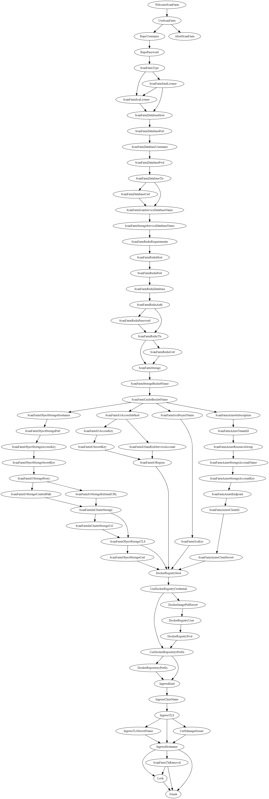
